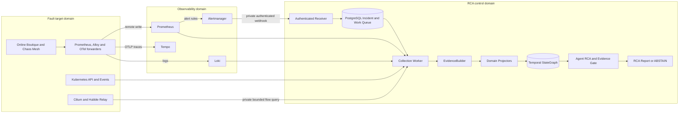

# Agent RCA

> Evidence-grounded infrastructure incident analysis for Kubernetes and
> cloud-native systems.

[](https://github.com/kyunghoon02/agent-RCA/actions/workflows/ci.yml)

## Problem

Cloud-native 장애의 원인은 metric 하나나 log 한 줄에만 있지 않다. 배포 변경,
workload, metric, log, trace, Kubernetes Event와 network flow를 같은 Incident time
window 안에서 함께 확인해야 한다. 일반적인 LLM 요약은 시간상 가까운 변경이나 운영
문서를 실제 원인 Evidence로 오인할 수도 있다.

Agent RCA는 Incident scope를 먼저 고정하고, 여러 관측 소스의 데이터를 검증된
`EvidenceItem`으로 정규화한다. 이후 [KRCA-style drilldown](contracts/krca-drilldown.md),
즉 KRCA 논문에서 차용한 API-level failure/latency propagation 분석과 Temporal
StateGraph가 조사 범위를 줄이고, bounded read-only Agent가 그 범위 안에서 Evidence를
검사한다. 이 프로젝트는 KRCA 논문의 전체 시스템이 아니라 이 drilldown 범위만 구현한다.
모든 결론은 실제 `evidence_id`로 추적하며, 근거가 부족하거나 충돌하면 추측하지 않고
`ABSTAIN`한다.

## How It Decides

`Frozen Context`는 분석 시작 시점에 선택한 Entity, Graph 경로, Evidence와 누락 source를
고정한 변경 불가능한 Incident snapshot이다. 따라서 live cluster 상태가 나중에 바뀌어도
Agent가 무엇을 보고 판단했는지 재현할 수 있다.

`Evidence Gate`는 Agent가 고른 원인과 인용한 `evidence_id`가 이 snapshot 안에 있고,
원인별 필수 증명 조건을 만족하는지 다시 검사한다. 통과하면 Report를 저장하고, 근거가
부족하거나 충돌하면 원인을 추측하지 않고 `ABSTAIN`을 저장한다.

## Runtime Walkthrough

아래 화면은 GCP reference runtime에 저장된 실제 Incident를 read-only로 조회한 것이다.
첫 두 화면은 통제된 OOM 장애를 **Prometheus가 직접 감지한 사례**이고, 마지막 화면은
**평가용 Alert로 시작한 no-fault 대조군**이다. 공개 캡처의 Incident·Context·Report·Evidence
ID와 Pod 식별자는 일관된 별칭으로 치환했다. 저장된 artifact, 판정, 수치와 Evidence 관계는
변경하지 않았다.


`OnlineBoutiqueRecentOOMRestart`에서 시작한 Incident가 `REPORTED`까지 진행됐고,
OOM 가설은 `PROVEN`이다. 선택된 원인의 미충족 증명 조건은 0개이며, 대안 가설의 미충족
조건 2개는 별도로 표시한다. 이는 수집 실패나 Evidence 객체 누락 개수가 아니다.


`Cited by Report`로 필터링하면 같은 Pod UID에 관한 세 근거를 대조할 수 있다.
Kubernetes의 `OOMKilled`·exit code 137, Prometheus의 restart 증가 1회, Loki의 kernel
cgroup OOM 신호가 동일한 Frozen Context에 포함된다. 메모리 제한에 의한 종료를 입증하는
것이지, 애플리케이션 내부의 메모리 누수까지 진단한 것은 아니다.


no-fault control에서는 분석 작업 자체는 정상 완료되지만, 원인별 증명 조건을 만족하지 않아
root cause를 만들지 않고 `ABSTAIN`한다. 화면의 6개 누락 조건은 미확정 가설에 관한 것이며,
이 대조군의 결과를 모든 정상 서비스에 대한 무오탐 보장으로 해석하지 않는다.

### Five-minute Demo

새 장애를 주입하지 않고 위 두 종류의 저장된 Incident를 조회한다. Viewer에서
`OnlineBoutiqueRecentOOMRestart`를 검색해 2026-09-05에 생성된 `REPORTED` 사례를 선택한다.
공개 캡처의 별칭 ID는 검색용 실제 ID가 아니다. 아래 시연 시간은 설명 순서이며 실제 장애
감지·분석 소요 시간이 아니다.

| Time | Viewer에서 확인할 내용 | 설명할 핵심 |
|---|---|---|
| 0–1분 | OOM Incident의 `Overview`와 `Timeline` | Alert 수신 후 collection, localization, analysis가 별도 work 단계로 진행됨 |
| 1–2분 | `RCA Report`의 인용을 눌러 `Evidence` 확인 | Kubernetes·Prometheus·Loki 세 근거의 Pod UID·관측 시각·provenance를 대조함 |
| 2–3분 | `Frozen Context`와 Report의 가설·analysis budget | 분석에 사용한 scope와 Evidence를 고정하고, Agent의 결론을 독립 Evidence Gate가 검증함 |
| 3–4분 | `AgentRCAControlledNoFault`의 `RCA Report` | 정상 traffic의 대조군에서는 원인을 만들어내지 않고 `ABSTAIN`함 |
| 4–5분 | [평가 기록](evaluation/REPORT.md) | native 감지 1회와 평가용 Alert 기반 matrix를 구분하고, 개선과 실패를 함께 설명함 |

코드는 [Alert 정규화](src/incident_platform/incidents.py) →
[수집 조율](src/incident_platform/collectors.py)·[EvidenceBuilder](src/incident_platform/evidence.py) →
[Context 고정](src/incident_platform/localization.py) →
[AgentRCAService와 EvidenceGate](src/incident_platform/agent_rca.py) 순으로 따라간다.

대표 OOM 사례는 resource limit 변경과 Chaos Mesh `StressChaos`로 실제 장애를 유발하고,
PrometheusRule → Alertmanager → Receiver로 Incident를 생성했다. 평가용 Alert를 직접
제출하지 않았다. 반면 과거 반복 matrix의
[OOM 평가 실행기](automation/ansible/roles/checkout_oom_fault_harness/tasks/main.yml)는 장애를
확인한 뒤 평가용 Alert를 제출하므로, 그 matrix 점수는 자동 감지 성능을 포함하지 않는다.
[no-fault 대조군](evaluation/scenarios/frontend-no-fault-normal.yaml)은 Chaos를 주입하지 않고
정상 traffic과 평가용 Alert만 사용한다. `REPORTED`는 보고서 저장이지 서비스 복구 완료가
아니며, 실험 resource 복구는 평가 실행기가 담당한다. Agent는 write 작업을 하지 않는다.

## Architecture

> 논리 아키텍처는 cloud-neutral이며, 현재 reference runtime은 GCP Compute Engine의
> 독립된 single-node kubeadm Kubernetes 세 개다.



Alert 수신과 LLM 실행은 분리돼 있다. `rca_enabled=true`는 Alertmanager가 RCA 대상
Incident만 webhook으로 전달하게 하고, `agent_rca_enabled=true`는 연속 Agent Worker가
해당 Incident의 analysis work를 자동 claim할 수 있게 한다. Receiver는 Provider를 직접
호출하지 않고 PostgreSQL에 durable work를 먼저 저장하므로, Alertmanager 응답과 Evidence
수집 실패가 서로 영향을 주지 않는다.

서비스 오류율 Alert는 기존 `5% 초과 + 2분 유지` 조건을 사용한다. 별도
`OnlineBoutiqueRecentOOMRestart`는 최근 5분 OOM 종료 시각과 restart count를 확인하고
Pod → ReplicaSet → Deployment 소유 관계로 Service를 결정한다. 이는 조사 시작 신호이며
OOM root cause 확정은 여전히 수집된 Evidence와 Gate가 담당한다.

## Core Components

| Component | Input | Responsibility | Output |
|---|---|---|---|
| Alert Receiver | Alertmanager webhook | 인증, payload 검증, 정규화, 중복 제거 | `RECEIVED` Incident와 collection work |
| Incident Workers | PostgreSQL work row | lease/fencing 기반 claim과 lifecycle 진행 | collection/localization result |
| Providers | Incident scope와 time window | bounded read-only telemetry 조회 | `EvidenceDraft` batch |
| EvidenceBuilder | Provider draft | scope, provenance, redaction, hash, schema 검증 | immutable `EvidenceItem` |
| Projectors | validated Evidence | domain Evidence를 temporal Entity와 relation으로 변환 | versioned Graph records |
| StateGraph and Resolver | Graph records와 Incident source | exact Entity resolution과 bounded localization | `Frozen Context` |
| Agent RCA Orchestrator | Frozen Context | Evidence 후보 선택과 bounded read-only tool investigation | structured RCA draft |
| Evidence Gate | Agent draft와 inspected Evidence | citation, scope와 원인별 등록 Evidence 조건 재검증 | Report 또는 `ABSTAIN` |
| Viewer | 저장된 Incident artifacts | Incident, Evidence, Context, work와 Report 조회 | read-only UI/API |

Provider가 Graph record를 직접 만들지는 않는다. 모든 Provider output은
`EvidenceBuilder`를 통과한 후에만 저장되고, domain Projector만 검증된 Evidence를
StateGraph record로 변환한다. Persistent graph는 JSON 파일이 아니라 Neo4j에 저장하며,
상위 service와 Agent는 Cypher를 직접 실행하지 않는다.

## Evidence Sources

| Source | 현재 Incident 경로 | 역할 |
|---|---|---|
| Prometheus | 연결됨 | service 오류율·latency, Pod memory ratio와 restart delta, KRCA API dependency feature |
| Kubernetes API | 연결됨 | Service, Deployment, ReplicaSet, Pod와 EndpointSlice 상태 |
| Kubernetes Event | 연결됨 | OOM, scheduling, mount, image pull 등 resource Event |
| Loki/Alloy | 부분 연결 | Pod UID에 귀속된 kernel memcg OOM Evidence |
| Deployment history | 연결됨 | retained ReplicaSet 기반 image/resource 변경과 변경 부재 |
| Tempo | telemetry 검증 연결 | trace 저장과 service graph 생성, Incident trace Provider는 미연결 |
| Cilium/Hubble | 연결됨 | namespace·Pod root·time window로 제한한 flow/verdict/drop 집계. 원본 flow, IP와 L7 payload는 저장하지 않음 |
| Application log | 계획 | 일반 application/container log Incident Provider는 미연결 |

새 Provider도 동일한 `EvidenceDraft → EvidenceBuilder → EvidenceItem` 경계를 사용한다.
새 오류 유형을 지원하려면 Provider뿐 아니라 schema, Projector, localization policy와
평가 scenario를 함께 추가해야 한다.

## Evidence and Safety Boundaries

| Layer | Role | Can prove root cause? |
|---|---|---|
| Runtime Evidence | metric, log, resource state, Event, flow와 change history | 가능, `evidence_id` 필수 |
| Graph Context | Evidence에서 파생된 Entity, relation과 time interval | 조사 범위 결정 |
| Operational Knowledge | versioned architecture, catalog, runbook과 SLO | 불가능, 조사 reference 전용 |
| Incident Memory | 검증된 과거 Incident와 일반화된 진단 경험 | 후속 단계, 현재 Evidence로 재검증 필요 |
| Ground Truth | fault fixture 정답과 평가 label | runtime 접근 금지 |

모든 Provider와 Agent tool은 다음 조건을 따른다.

- namespace, resource와 Incident time window를 벗어난 query를 거부한다.
- write/admin tool, 자동 복구와 LLM 생성 shell 또는 `kubectl` 실행을 허용하지 않는다.
- 원본 telemetry는 source retention에 두고 Evidence에는 필요한 요약과 provenance만 저장한다.
- no data, timeout, 권한 거부와 Provider failure를 구분한다. source retention을 입증할 수
  없는 no-data 결과는 완전한 성공으로 취급하지 않는다.
- 일부 Provider가 실패해도 성공한 Evidence를 보존하고 불완전성을 Report에 표시한다.
- root cause는 등록된 원인별 증명 조건을 만족하는 runtime Evidence 인용 없이는 확정할 수 없다.

## Reference Runtime

| Layer | Implementation |
|---|---|
| Cloud | Google Cloud Compute Engine |
| Kubernetes | upstream Kubernetes, failure domain별 kubeadm single-node bootstrap |
| Container and network | containerd, Cilium CNI와 Hubble |
| Observability | Prometheus, Alertmanager, Grafana, Loki/Alloy, Tempo와 OTel Collector |
| Persistence | PostgreSQL 17.6, Neo4j Community와 local-path PVC |
| Reference workload | [Google Online Boutique](platform/online-boutique/README.md) `v0.10.6` |
| Provisioning | Terraform이 GCP foundation, Ansible이 host/cluster와 pinned workload 배포 담당 |

실제 reference runtime은 독립된 single-node Kubernetes 세 개로 나뉜다.

| Failure domain | Active responsibility |
|---|---|
| RCA control | Receiver, PostgreSQL queue, Evidence/Agent workers, Neo4j StateGraph, Viewer |
| Fault target | Online Boutique, Chaos Mesh, Kubernetes/Cilium Evidence source, telemetry forwarders |
| Observability | authoritative Prometheus, Alertmanager, Grafana, Loki와 Tempo |

도메인 간 endpoint는 public ingress가 아니라 GCP VPC의 tag 기반 firewall과 고정 private
NodePort만 사용한다. RCA worker의 Kubernetes credential은 fault target에서 발급한 read-only
ServiceAccount이며 Secret 읽기는 거부된다. 전환 전에 존재하던 fault-target control plane과
control-domain Online Boutique는 삭제하지 않고 `0 replicas`로 내렸고 PVC는 보존했다.

Chaos evaluation은 기존 v1.36 runtime을 제자리에서 내리지 않는다. Terraform의 기본값이
꺼진 병렬 VM을 명시적으로 생성해 Kubernetes v1.35.8을 부트스트랩했고, Chaos Mesh 2.8.4는
`online-boutique`만 대상으로 하는 namespace-scoped mode로 설치했다. checkoutservice
OOM과 missing ConfigMap, paymentservice ImagePullBackOff를 통제 실행으로 end-to-end
재현했다. 각 평가 종료 시 실행기의 resource 복구와 활성 fault 0개를 확인했으며, 상세 결과는
[평가 기록](evaluation/REPORT.md)에 남겼다. fault 실행은 별도 scenario 검토와
`CONFIRM_CONTROLLED_FAULT=yes` 승인을 요구한다.

이 runtime은 application/Kubernetes/Cilium fault 실험용이다. 각 failure domain이 여전히
single-node이므로 production HA, zone 장애와 managed control-plane 장애를 증명하지 않는다.
PostgreSQL, Neo4j와 telemetry PVC는 각 VM disk에 묶여 있으며 `Retain`은 backup이 아니다.

## Evaluation

평가는 실제 Kubernetes runtime에서 재현한 `Change × Workload` Incident를 사용한다.
Ground Truth는 Agent runtime과 격리하고, 완료된 Prediction에만 결합해 accuracy,
Evidence precision/recall, `ABSTAIN` correctness, latency와 LLM/tool cost를 계산한다.

| Evaluation boundary | Result | Interpretation |
|---|---|---|
| 수정 전 / 수정 후 frozen matrix, 각 20회 | 기대 결과 9/20 → 20/20; fault Top-1 4/15 → 15/15; no-fault `ABSTAIN` 각각 5/5 | 같은 등록 scenario의 regression 비교 |
| Holdout v1 / temporal replication, 각 12회 | 기대 결과 12/12 → 11/12; 재실행 1건은 schema 위반으로 fail-closed | 같은 원인 taxonomy의 미사용 surface variant |
| Strict structured output, 8회 | `REPORT_ACCEPTED` 8/8; contract rejection 0 | 알려진 scenario 재사용, 작은 표본의 출력 계약 검증 |
| Native Prometheus OOM 감지, 1회 | 평가용 Alert 제출 없이 Report 수락; Incident 수신 → Report 27초 | 자동 감지부터 보고까지 단일 연결성 검증 |

평가용 Alert 기반 matrix의 unsupported citation은 모두 0건이다. 그러나 이 결과는 등록된
단일 원인 fault 세 종류와 no-fault 한 종류에 한정되며 production 정확도가 아니다.

native 검증의 첫 OOM 실행에서는 기존 오류율 규칙의 `for: 2m`을 유지하지 못해 Incident가
생성되지 않았다. 이 실패는 보존했다. 이후 별도 OOM/restart 규칙을 검증·배포하고
2026-09-05 후속 1회에서 Report와 resource 복구, 자연 resolved webhook을 확인했다.
27초는 **Incident 수신 이후** 시간이며 장애 발생부터의 감지 지연이나 운영 SLO가 아니다.
frontend 영향에서 하위 서비스 원인을 찾는 경로도 이 단일 사례의 검증 범위가 아니다.

수치, 실패 분석, 수정 경계, cleanup과 재현 명령은
[Evaluation and Reliability Record](evaluation/REPORT.md)에 둔다. 실패를 성공으로
재분류하거나 재실행해 덮지 않는다. 평가 조건은
[Regression Preregistration](evaluation/preregistration.yaml)과
[Holdout v1 Preregistration](evaluation/holdout-v1-preregistration.yaml)이 담당한다.

## Known Limitations

- 세 failure domain은 분리됐지만 각 도메인은 single-node이며 observability domain 자체는 HA가 아니다.
- VM1의 기존 observability stack은 control-plane queue/dashboard 관측용 shadow로 남아 있다.
  control telemetry까지 VM3로 통합한 뒤 제거 여부를 별도로 결정해야 한다.
- fault target의 `forwarder` profile도 전환기에는 base Prometheus/Loki/Tempo/Grafana
  구성 요소를 유지한다. target telemetry의 authoritative 저장·조회는 VM3지만,
  경량 forwarder-only profile과 기존 local telemetry PVC 정리는 후속 작업이다.
- PostgreSQL, Neo4j와 local PV의 backup/restore 및 HA가 구현되지 않았다.
- fault-target 원격 조회 credential은 제한된 RBAC의 장기 ServiceAccount token이며,
  production workload identity와 자동 rotation은 아직 구현되지 않았다.
- 일반 application log와 trace를 Incident Evidence로 수집하는 Provider가 없다.
- Hubble Relay의 bounded buffer가 Incident 전체 window를 보존했는지는 현재 입증할 수 없다.
  따라서 matching flow가 없으면 `PARTIAL`과 retention `UNKNOWN`으로 남긴다.
- fault-target Hubble Relay는 public endpoint가 아닌 VPC 내부 제한 NodePort지만, Relay
  구간의 mTLS는 아직 구성하지 않았다.
- Prometheus alert rule은 있지만 실제 운영 notification channel은 아직 연결하지 않았다.
- public Viewer ingress, session authentication과 role authorization이 없다.
- 현재 root-cause taxonomy는 OOMKilled, image pull failure와 missing ConfigMap 세 종류만 등록돼 있다.
- 평가는 한 reference environment의 작은 표본이다. 알려지지 않은 장애, multi-factor 원인,
  다른 cluster topology와 production 정확도는 검증하지 않았다.
- 과거 schema 위반 1건은 당시 validation 좌표가 없어 실패 field를 사후 구분할 수 없다.
  현재 새 실패는 원본 draft나 값을 저장하지 않고 JSON/schema Pointer와 keyword만 audit와
  Viewer에 남긴다. 후속 8회 통과도 장기 production reliability를 입증하지 않는다.
- 자동 remediation은 의도적으로 지원하지 않는다.

## Quick Start

로컬 contract, 문서 링크와 core test:

```bash
make bootstrap-dev
make validate-docs
make validate-core
```

CI는 임시 PostgreSQL 17.6에서 repository 통합 테스트와 Viewer 검색·pagination도 검증한다.
로컬 통합 테스트는 별도 테스트 DB를 `POSTGRES_TEST_DSN`으로 지정할 때 실행한다.

GCP foundation 생성은 [GCP Infrastructure](infra/terraform/README.md), kubeadm/Cilium과
세 failure domain 배포·검증은
[Kubernetes Bootstrap and Deployment](automation/ansible/README.md)를 따른다. workload와
telemetry 설정은 각각 [Online Boutique target](platform/online-boutique/README.md)과
[Observability stack](platform/observability/README.md)에 기록한다.

Controlled evaluation은 development runtime과 명시적 승인에서만 실행한다. Ground Truth
격리, fault cleanup, 반복·holdout 절차와 재현 명령은
[Evaluation and Reliability Record](evaluation/REPORT.md)가 담당한다. Viewer는 public
Ingress 없이 RCA control cluster의 `ClusterIP`로만 배포하며, private access와 API 경계는
[Viewer Contract](contracts/viewer.md)에서 확인한다.

## Repository Structure

```text
automation/          kubeadm과 platform 배포 Ansible
config/              project scope, readiness와 RCA routing policy
contracts/           Incident, Evidence, Graph, RCA와 Provider contract
db/                  PostgreSQL와 opt-in pgvector migration
evaluation/          preregistration, scenario와 Ground Truth isolation policy
frontend/viewer/     read-only Incident/RCA Viewer
infra/terraform/     GCP VPC, IAM과 Compute Engine provisioning
knowledge/           versioned operational reference와 retrieval index
platform/            Kubernetes manifest와 Kustomize base
src/                 Incident, Evidence, StateGraph와 Agent RCA core
tests/               deterministic fixture와 contract test
tools/               validation, smoke와 evaluation tool
```

## Documentation

`README.md`는 현재 아키텍처와 구현 상태를 설명하고, `evaluation/REPORT.md`는 측정 결과와
claim boundary를 기록한다. `contracts/`와 `config/`는 machine-validated 규칙의 source of
truth이고, 하위 README는 해당 컴포넌트의 설치·실행 명령만 담당한다. 진행 기록과 roadmap은
별도 Markdown으로 복제하지 않으며, 변경 시 코드와 영향받는 contract를 같은 변경 단위에서
갱신한다. `make validate-docs`는 Git이 추적하는 Markdown의 로컬 경로와 외부 링크를 검사한다.

- [Provider Contract](contracts/providers.md)
- [Evidence Contract](contracts/schemas/evidence-item.schema.json)
- [KRCA-style API Drilldown](contracts/krca-drilldown.md)
- [Temporal StateGraph Model](contracts/graph/stategraph-model.yaml)
- [Viewer Contract](contracts/viewer.md)
- [Agent RCA Runtime Scope](config/project-scope.yaml)
- [Evaluation and Reliability Record](evaluation/REPORT.md)
- [Evaluation Preregistration](evaluation/preregistration.yaml)
- [Holdout v1 Preregistration](evaluation/holdout-v1-preregistration.yaml)
- [GCP Infrastructure](infra/terraform/README.md)
- [Kubernetes Bootstrap and Deployment](automation/ansible/README.md)
