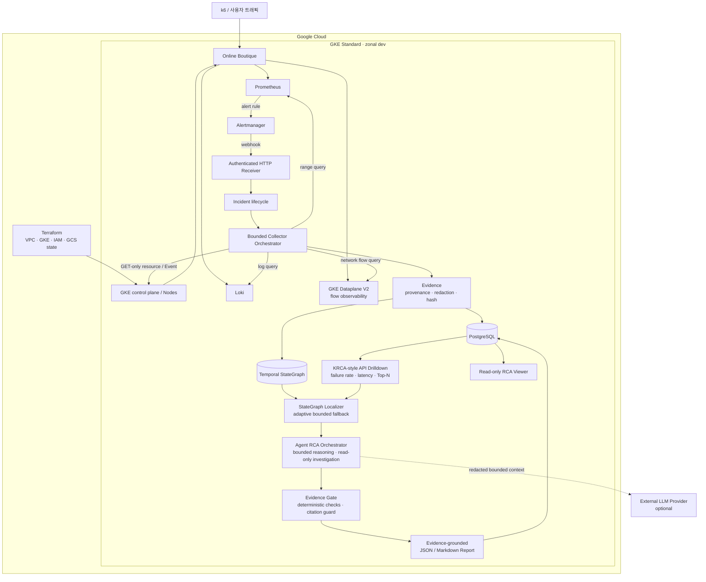

# Agent RCA

GCP에 재현 가능한 GKE Standard 운영환경을 만들고,
Prometheus·Loki·Alertmanager·Kubernetes API·GKE Dataplane V2에서 수집한 Evidence로
Google Online Boutique 장애를 재현·분석하는 evidence-grounded Agent RCA 및
인프라/SRE 포트폴리오다.

이 프로젝트의 Agent RCA는 LLM이 근거 없이 원인을 추측하는 기능이 아니다.
Agent RCA Orchestrator가 bounded Evidence, Temporal StateGraph와 read-only 조사
도구를 사용해 Incident 분석을 주도하고, 모든 결론을 실제 Evidence로 추적한다.
Deterministic rule은 별도의 주 경로가 아니라 Agent 내부 Evidence Gate에서 명확한
장애 신호를 검증하고 조사를 조기 종료하거나 `ABSTAIN`시키는 안전장치다.

## 확정된 실행 경계

- cloud target: Google Cloud
- Kubernetes: GKE Standard
- dev availability: zonal cluster; 실제 region/zone은 Terraform 입력으로 확정
- network dataplane/evidence: GKE Dataplane V2와 관리형 flow observability
- workload identity: Workload Identity Federation for GKE
- Terraform remote state: versioning을 활성화한 사전 생성 GCS bucket
- target application: Google Online Boutique `v0.10.6`
- RCA 권한: read-only, bounded query, 근거 부족 시 `ABSTAIN`

GCP/GKE 설계 경계는 확정했지만 target project, billing, region/zone, quota,
Application Default Credentials와 state bucket은 아직 runtime 확인 전이다.
따라서 Terraform contract 구현은 시작할 수 있지만 실제 `plan/apply` 성공이나
GKE runtime은 검증됐다고 표현하지 않는다.

## 포트폴리오에서 보여줄 역량

1. GCP project bootstrap과 GKE 기반을 Terraform으로 재현한다.
2. VPC-native GKE Standard, Dataplane V2와 Workload Identity 경계를 검증한다.
3. metric, log, event, resource state와 network flow를 Incident time window로 묶는다.
4. 반복 가능한 fault fixture와 수동 troubleshooting 결과를 자동 RCA와 비교한다.
5. 최소 권한, redaction, timeout, partial failure, 비용과 destroy 경계를 검증한다.
6. 모든 RCA 결론을 `evidence_id`로 추적하고 근거가 부족하면 판단을 보류한다.

AI/LLM 기능보다 인프라 생성, 관측, 장애 재현, troubleshooting과 운영 검증
Evidence를 먼저 제시한다.

## 목표 아키텍처



Alertmanager는 장애 신호를 전달하고, RCA 플랫폼은 Incident 범위 안에서 각
provider를 read-only로 조회한다. 수집 결과는 provenance와 hash를 가진 Evidence로
정규화된다. Agent RCA Orchestrator는 저장된 Evidence와 StateGraph를 바탕으로
조사를 수행하고, deterministic check와 citation guard를 통과한 판단만 보고서로
만든다. 모든 원인 판단과 보고서는 실제 `evidence_id`를 통해 역추적할 수 있다.

현재 fixture 구현 범위에는 Incident/Evidence pipeline, deterministic Fast Path,
StateGraph core, KRCA-style drilldown scorer와 adaptive fallback contract가 포함된다.
API별 시계열 feature 추출, 실제 dependency graph, Agent RCA orchestration,
optional LLM 연동과 runtime 통합은 아직 구현·검증됐다는 뜻이 아니다.

## 데이터 수집 경계

- query에는 `online-boutique` namespace, workload와 Incident time window가 반드시
  포함된다.
- 원본 metric/log/network flow는 각 관측 시스템의 retention에 두고, Evidence와
  StateGraph에는 요약, provenance, content hash와 필요한 state만 저장한다.
- 검색 결과 없음, retention 만료, timeout과 provider 실패를 구분한다.
- Dataplane V2 flow는 보조 evidence이며 모든 장애의 기본 원인을 대신 판정하지 않는다.

## Provider 확장 계획

현재 구현 범위는 bounded HTTP transport, Prometheus range-query와 Kubernetes
resource/Event read-only provider다. 아래 provider는 장애 원인 범위를 넓히기 위한
후속 후보이며, 현재 코드·배포 manifest·runtime 연동이 구현됐다는 뜻이 아니다.

- Loki application/container log
- OpenTelemetry trace
- GKE Dataplane V2 network flow
- Git·Argo CD·Kubernetes rollout 기반 deployment/change history
- database connection, lock, replication과 slow-query 상태
- queue/worker backlog, consumer와 retry 상태
- node OS, container runtime과 filesystem 상태
- DNS, Ingress, Load Balancer와 external dependency 상태
- cloud audit/event와 quota 상태

추가 provider는 실제 fault scenario가 필요성을 입증할 때 하나씩 구현한다. 모든
provider는 원인을 직접 선언하지 않고 관측 사실을 공통 `EvidenceItem`으로
정규화하며, read-only scope, time window, item/response limit, provenance,
redaction과 partial failure 계약을 따라야 한다.

KRCA의 API dependency/metric feature provider는 위의 일반 관측 범위 확장
provider와 구분한다. 이 provider는 primary localization 입력을 만드는 core
dependency이므로 StateGraph 연결형 vertical slice와 service-to-Entity resolver
계약을 먼저 고정한 직후 구현하고, Persistent Graph backend와 Agent runtime보다
앞서 실제 Top-N seed 흐름에 연결한다.

## 범용 Temporal StateGraph 방향

StateGraph core는 Kubernetes, 특정 fintech 업무 또는 ChainOps ontology에
종속시키지 않는다. 현재 Online Boutique는 첫 reference workload일 뿐이며,
범용 core는 운영 장애를 설명하는 다음 네 record와 Evidence 연결만 책임진다.

전체 Evidence-to-Graph 흐름과 계층별 책임은 다음과 같다.

```text
Prometheus / Kubernetes API·Event / Loki / Dataplane V2 / 기타 관측 소스
    ↓ read-only 수집
Provider → Collector / EvidenceBuilder → contract-valid EvidenceItem
    ├─ API metric/dependency feature → KRCA-style drilldown → Top-N service seeds
    └─ Domain Projector → GraphRepository → Graph DB

Top-N seeds + Graph DB
    ↓
GraphLocalizer → initial bounded Context
    ↓
AdaptiveScopeController          KRCA next-ranked 또는 현재 경계 Entity만 승인
    ↺ 충돌·복수 가설·복합 원인일 때 hard cap 안에서 재실행
    ↓
Frozen Context Package 또는 budget exhaustion/ABSTAIN
    ↓
RCA Agent                       후속 구현
```

Provider는 `GraphRecord`를 직접 생성하지 않는다. Provider는 관측 결과를
`EvidenceDraft`로 반환하고, `EvidenceBuilder`가 provenance, hash, redaction과
schema 검증을 적용해 공통 `EvidenceItem`으로 정규화한다. 도메인별 Projector만
검증된 `EvidenceItem`을 읽어 Graph의 Entity, 상태, 관계와 Event 집계로 변환한다.
따라서 Provider는 Evidence 계약에, Projector는 Evidence와 Graph record 계약에,
GraphRepository는 Graph record 계약에 각각 의존한다.

```text
Entity            조사 가능한 서비스, 프로세스, 데이터 저장소, 인프라 리소스
SnapshotInterval  한 Entity의 정규화된 상태가 유효했던 시간 구간
RelationInterval  Entity 사이 관계가 유효했던 시간 구간
EventAggregate    반복된 상태 변화나 운영 Event의 시간 기반 집계
```

각 record는 안정적인 ID, `valid_from`/`valid_to`, 정규화된 state 또는 relation,
provenance와 `evidence_id`를 가져야 한다. 원본 metric, log, trace와 resource JSON
전체를 Graph에 복제하지 않고, 검증된 Evidence에서 파생된 상태와 관계만 저장한다.

도메인 차이는 core schema가 아니라 projector가 담당한다.

```text
Kubernetes projector  Deployment, Pod, Service, Node, Config, Volume
Web service projector API, Service, Job, Queue, Cache, Database, Dependency
Fintech projector     Request, Transaction, Ledger/Settlement state, Gateway
```

공통 관계는 `DEPENDS_ON`, `CALLS`, `ROUTES_TO`, `PROCESSES`, `READS_FROM`,
`WRITES_TO`, `RUNS_ON`, `CHANGED_BY`처럼 운영 의미 중심으로 제한한다. 특정 도메인
관계가 필요하면 별도 projector vocabulary로 확장하되 Agent에 전달하기 전 공통
Context Package로 변환한다.

현재 domain-neutral Graph record와 `InvestigationScope`, 연속 동일 상태/관계를
병합하는 in-memory interval repository, Kubernetes Evidence projector, KRCA-style
API drilldown, bounded localizer와 adaptive fallback까지 fixture로 구현했다. Adaptive
controller는 현재 Context Entity 또는 KRCA가 승인한 다음 순위 seed만 열고
시간·도메인·관계 경계는 유지한다. Persistent Graph backend, API metric feature
provider, Kubernetes watch와 실제 Agent assessment 연결은 아직 구현하지 않았다.

KRCA-style drilldown은 장애율 상관관계와 latency anomaly, fluctuation contribution,
correlation을 이용해 호출 edge를 점수화한다. 핵심은 다음처럼 장애율과 latency 중
더 강한 전파 신호를 선택하는 것이다.

```text
Score(P, C) = max(FailureRateScore(P, C), LatencyScore(P, C))
```

threshold를 통과한 API만 재귀 탐색하고 service Top-N을 StateGraph localization의
초기 후보로 전달한다. 식의 정의, paper-aligned 기본값, feature 계산 책임과 한계는
[KRCA-style API Drilldown Contract](contracts/krca-drilldown.md)에 분리했다.

다음 구현 순서는 다음과 같이 고정한다.

1. `StateGraphRepository` port와 `IncidentLocalizationService`를 정의한다.
2. service-to-Entity resolver 계약을 만들고 기존 Kubernetes Evidence로
   `Projector → StateGraph → Frozen Context` 연결형 vertical slice를 검증한다.
3. API dependency/metric feature provider를 구현한다.
4. KRCA Top-N service를 StateGraph seed로 해석하는 runtime 흐름을 연결한다.
5. 같은 repository contract를 만족하는 Persistent Graph backend를 구현한다.
6. Graph-localized Context만 조회하는 bounded read-only RCA Agent를 연결한다.

Loki, Dataplane V2 flow, OpenTelemetry와 DB/Queue 등 일반 확장 provider는 이 core 흐름을
검증한 뒤 실제 fault scenario가 요구할 때 추가한다.

## 저장소 구조

```text
config/              프로젝트 범위, GCP readiness, RCA routing 정책
contracts/           Incident, Evidence, Graph, RCA 및 provider 계약
db/migrations/       PostgreSQL schema migration
docs/                아키텍처, ADR, runbook, 진행 기록
evaluation/          평가 사전등록과 Ground Truth 격리 정책
infra/terraform/     GCP bootstrap과 GKE provisioning 경계
platform/            cloud-neutral Kubernetes manifest와 Kustomize base
src/                 Incident/Evidence/RCA core
tests/               deterministic fixture와 core unit test
tools/               정적 검증 도구
```

## 현재 가능한 검증

초기 1회 로컬 검증 환경을 만든다.

```bash
make bootstrap-dev
```

`requirements.txt`는 Core가 직접 import하는 런타임 라이브러리,
`requirements-dev.txt`는 위 의존성과 YAML 기반 로컬 검증 도구를 설치한다.
개발 환경은 `platform/versions.yaml`과 동일하게 Python 3.12를 사용한다.

그다음 Core 검증을 실행한다.

```bash
make validate-core
```

이 검증은 contract, 인증·request limit이 적용된 Alertmanager HTTP 경계,
입력 정규화, Incident lifecycle, Collector의 병렬 실행·timeout·retry·partial
failure, Evidence redaction/hash, deterministic RCA와 Fast Path report를
fixture로 확인한다.

`POSTGRES_TEST_DSN`이 없는 기본 검증에서는 실제 DB 테스트 한 건을 건너뛴다.
승인된 테스트 전용 PostgreSQL DSN을 환경 변수로 제공하면 random schema를
만들어 동일 repository contract를 실행하고 그 schema만 제거한다. 공유 DB를
truncate하지 않으며 DSN을 저장소나 명령 출력에 기록하지 않는다.

GCP 설계와 실제 `plan/apply` 준비 상태는 다음 명령으로 분리해 확인한다.

```bash
make gcp-readiness
```

현재 설계 gate는 준비됐지만 project, billing, location, 인증, API와 GCS backend가
실제 확인되기 전에는 `plan/apply` 준비 미완료 상태를 의도적으로 반환한다.

## 상세 문서

- [GCP/GKE 실행 환경 ADR](docs/adr/0007-gcp-gke-runtime-boundary.md)
- [GCP/GKE 목표 아키텍처](docs/architecture/gcp-overview.md)
- [GCP/GKE Readiness Matrix](docs/provider/gcp-readiness-matrix.md)
- [GCP/GKE 구현 로드맵](docs/roadmap/gcp-plan.md)

Online Boutique remote base render에는 GitHub 접근이 필요하다.

```bash
kubectl kustomize platform/online-boutique
```
