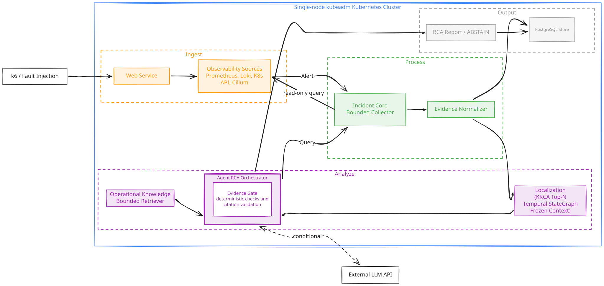
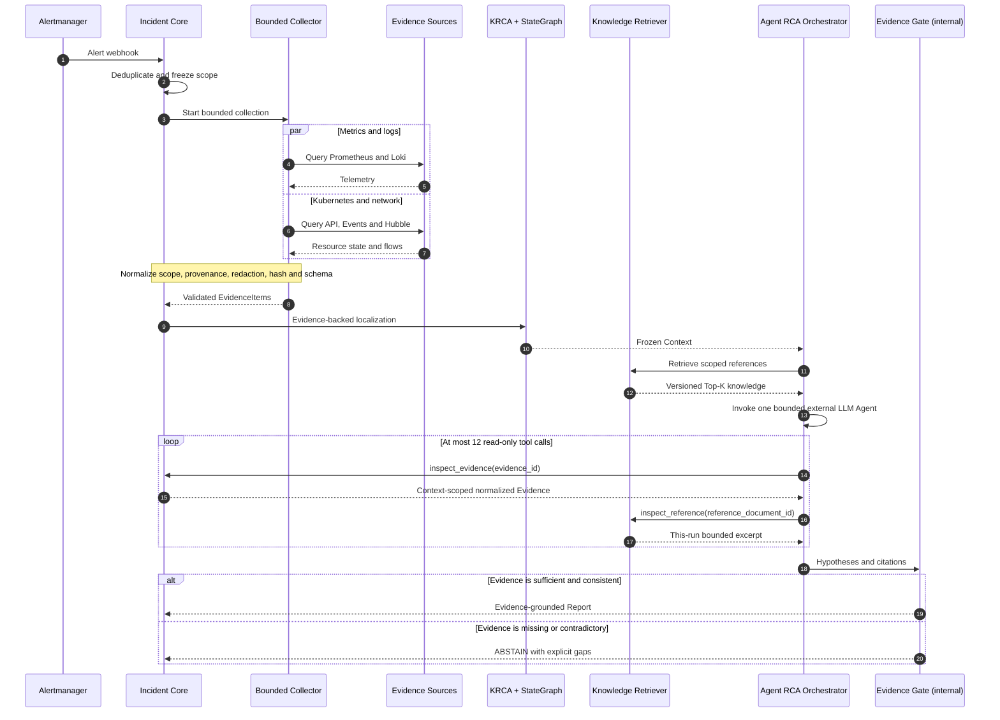

# Agent RCA

Agent RCA는 운영 장애를 bounded read-only Evidence로 조사하고, 모든 결론을 실제
`evidence_id`로 추적하는 evidence-grounded incident analysis platform이다. 근거가
충분하지 않거나 서로 충돌하면 원인을 추측하지 않고 `ABSTAIN`한다.

Agent RCA Orchestrator가 Incident 조사 상태와 budget을 관리하며, deterministic
rule과 citation validation은 별도 주 경로가 아니라 Orchestrator 내부 `Evidence Gate`로
동작한다. 이 저장소는 cloud-neutral RCA core와 Kubernetes reference runtime을 함께
구축한다.

## 목표 아키텍처



> Cloud-neutral logical architecture이며, single-node kubeadm Kubernetes는 현재
> reference runtime이다.

## Incident 조사 흐름



KRCA-style API Drilldown은 failure-rate와 latency propagation으로 Top-N service
seed를 만들고, Temporal StateGraph는 관련 Entity와 시간 구간만 `Frozen Context`로
고정한다. Operational Knowledge는 localized Entity 범위 안의 조사 reference로만
사용하며 root cause는 실제 `evidence_id` 없이는 확정하지 않는다.

## Evidence와 안전 경계

| 입력 계층 | 역할 | 원인 증명 가능 여부 |
|---|---|---|
| Runtime Evidence | metric, log, resource state, Event, network flow와 change history | 가능, `evidence_id` 필수 |
| Graph Context | Evidence에서 파생된 Entity, 상태·관계와 시간 구간 | 조사 범위 결정 |
| Operational Knowledge | versioned architecture, catalog, runbook과 SLO | 불가능, 조사 reference 전용 |
| Incident Memory | 검증된 과거 Incident와 일반화된 진단 경험 | 후속 단계, runtime Evidence로 재검증 필요 |
| Ground Truth | fault fixture 정답과 평가 label | RCA runtime 접근 금지 |

모든 provider와 Agent tool은 다음 불변 조건을 따른다.

- namespace, resource와 Incident time window를 벗어난 query를 거부한다.
- write/admin tool, 자동 복구와 LLM이 생성한 shell 또는 `kubectl` 실행을 허용하지 않는다.
- 원본 telemetry는 source retention에 유지하고 Evidence에는 필요한 요약과 provenance만 저장한다.
- 검색 결과 없음, retention 만료, timeout, 권한 거부와 provider failure를 구분한다.
- 일부 collector가 실패해도 성공한 Evidence를 보존하고 불완전성을 Report에 표시한다.
- root cause는 runtime Evidence 인용 없이는 확정할 수 없다.

## Reference Runtime

- cloud: Google Cloud
- compute: Compute Engine 단일 VM
- Kubernetes: upstream Kubernetes, kubeadm single-node bootstrap
- container runtime: containerd
- dataplane and network evidence: Cilium CNI와 Hubble
- observability: Prometheus, Alertmanager, Grafana, Loki/Alloy와 Kubernetes API/Event
- graph: Neo4j Community 기반 temporal StateGraph
- operational knowledge index: Git source + PostgreSQL/pgvector derived index
- reference workload: Google Online Boutique `v0.10.6`
- state: versioning을 활성화한 사전 생성 GCS Terraform backend
- identity: 전용 최소 권한 VM service account
- RCA permission: Kubernetes와 observability source에 대한 bounded read-only access

Terraform은 VPC, subnet, firewall, IAM과 Compute Engine lifecycle까지만 소유한다.
Ansible은 containerd와 kubeadm host/cluster bootstrap을 소유하고, Ansible이 실행하는
고정 Helm release가 Cilium/Hubble과 observability stack을 설치한다. target workload와
Agent RCA 배포는 그 다음 Kubernetes deployment 계층이 담당한다. Reference runtime은 교체할 수 있으며 RCA core와
Evidence contract는 GCP나 특정 workload ontology에 종속되지 않는다.

## Evaluation Strategy

Agent RCA는 공개 사용자 수가 아니라 실제 Kubernetes runtime에서 재현한
`Change × Workload` Incident로 평가한다. 변경이 잠재 결함을 만들고 특정 요청 경로,
동시성 또는 부하가 이를 드러내는 운영 상황을 중심으로 다음 네 실험 셀을 비교한다.

| Change | Workload | 평가 목적 |
|---|---|---|
| 없음 | normal | 정상 baseline과 false positive 측정 |
| 있음 | normal | 배포·설정 자체의 regression 분리 |
| 없음 | stress | 순수 traffic·capacity 문제 분리 |
| 있음 | stress | 변경과 workload가 결합된 Incident 평가 |

Change Evidence에는 Git commit과 manifest diff, Deployment/ReplicaSet revision, image
digest, ConfigMap metadata hash, resource limit, NetworkPolicy와 rollout/rollback 시각을
포함한다. Secret value는 수집하지 않으며 Change history만으로 root cause를 확정하지
않는다. 변경이 실제 metric, log, Event, trace 또는 Hubble flow 변화와 시간적·인과적으로
일치해야 한다.

대상 node의 resource signal을 오염시키지 않도록 load generator는 target node와 다른
failure domain에서 실행한다. baseline, spike, soak와 path-weighted workload마다 seed와
rate를 기록하고, 최소 15개 Incident scenario를 각각 5회 반복한다. 동일한 Frozen
Evidence는 A/B/C/D variant에 재사용하며 root-cause accuracy, Evidence precision/recall,
`ABSTAIN` correctness, latency, tool/LLM cost와 반복 재현성을 비교한다. Fault manifest와
Ground Truth는 Agent runtime에서 계속 격리한다.

### Knowledge Retrieval Ablation

Operational Knowledge 검색은 기존 `entity-key+lexical`을 baseline으로 유지하고 동일한
Frozen Context/query/corpus에서 `entity-key+vector`와
`entity-key+lexical+vector-rrf`를 비교한다. 승인 상태, 유효 기간, Entity 범위와 content
hash는 세 variant에서 동일한 hard filter로 고정하며 Vector 검색은 eligible 문서의
순위만 바꾼다.

| Variant | 목적 | 측정값 |
|---|---|---|
| Lexical | 기존 deterministic baseline | Hit@K, Recall@K, MRR@K, nDCG@K, p95 latency |
| Vector | semantic retrieval ablation | 동일 |
| Hybrid RRF | exact term과 semantic paraphrase 결합 | 동일 + lexical 대비 absolute delta |

현재 포함된 2개 문서/12개 query benchmark는 평가 pipeline pilot이며 정확도 개선
성과값이 아니다. 승인 문서 20개와 frozen query 30개 이상으로 확장한 뒤 생성되는
corpus/benchmark/model fingerprint가 있는 결과만 README의 portfolio 수치로 승격한다.

## 현재 구현 상태

> 기준일: 2026-08-22. 목표 아키텍처와 현재 executable/runtime evidence를 구분한다.

| 영역 | 현재 상태 | Runtime 상태 |
|---|---|---|
| Incident lifecycle, Collector, Evidence, Fast Path Report | fixture와 unit test 구현 | production server/cluster 미연결 |
| Bounded HTTP, Prometheus, Kubernetes provider | adapter와 contract test 구현 | live source 미연결 |
| PostgreSQL repository | migration과 repository contract 구현 | test DSN 선택 검증, runtime 미배포 |
| KRCA metric feature provider, scorer, Entity resolver와 StateGraph localization | Evidence-to-Top-N-to-resolved-seed fixture 및 Neo4j adapter/live contract 구현 | live PromQL/dependency config, continuous projection과 cluster Graph 미연결 |
| Operational Knowledge와 Retriever | lexical baseline, pgvector chunk adapter, vector-only/Hybrid RRF, hash/scope gate, 12-query pilot harness와 Agent reference tool 구현 | live pgvector sync/embedding 평가와 claim-ready corpus 미검증 |
| Agent RCA와 LLM tool-calling | OpenAI Agents SDK 단일 Agent, 구조화 draft, Evidence/Reference read-only tool 2개, Evidence Gate, Agent Run audit와 Report 저장 구현 | fixture contract 통과, live API는 계정 credit 부족으로 429; 성공 runtime 미검증 |
| Read-only RCA Viewer query | bounded list/filter/keyset cursor, artifact detail과 timeline contract 구현 | HTTP API/UI와 production query plan 미구현 |
| Change × Workload evaluation | preregistration과 matrix 정의 | harness, Change Provider와 runtime dataset 미구현 |
| GCP, Terraform, kubeadm, Cilium/Hubble | foundation apply와 재계획 검증, pinned Ansible kubeadm 및 Cilium/Hubble bootstrap 구현 | Kubernetes v1.36.4 single-node가 재부팅 후 복구됐으며 Cilium/Hubble과 read-only flow 조회 검증; destroy와 fault runtime 미검증 |
| Observability stack | pinned Helm values와 Ansible deploy/verify 구현 | Prometheus/Alertmanager/Grafana, Loki/Alloy 배포; PVC 4개 Bound, Cilium/Hubble target `up=1`, normalized Kubernetes log stream 확인. alert rule/webhook과 RCA provider runtime은 미연결 |

Single-node reference runtime은 application/Kubernetes/Cilium fault 실험용이며
production HA, cross-node networking, node pool autoscaling, zone 장애 또는 managed
control-plane 장애를 증명하지 않는다. VM 장애까지 분석하려면 Agent control plane을
별도 failure domain으로 분리해야 한다.

## Core Localization 설계

Provider는 `GraphRecord`를 직접 만들지 않는다. `EvidenceDraft`를 반환하면
`EvidenceBuilder`가 provenance, redaction, hash와 schema를 검증하고, domain
Projector만 검증된 Evidence를 Entity, `SnapshotInterval`, `RelationInterval`과
`EventAggregate`로 변환한다.

```text
Validated Evidence
→ domain Projector
→ versioned EntityIdentity + temporal Graph records
→ exact/time-bounded ServiceToEntityResolver
→ bounded InvestigationScope
→ IncidentLocalizationService
→ Frozen Context
```

Kubernetes 실제 리소스 identity는 trusted `cluster_id + metadata.uid`이고, UID가 없는
참조는 cluster-aware placeholder로 남긴다. 동일 좌표의 실제 리소스가 나중에 확인되면
기존 Entity를 덮어쓰지 않고 `RESOLVES_TO`로 연결한다. 애플리케이션의 논리 Service와
Kubernetes Service도 별도 Entity로 두고 `REPRESENTED_BY`로 연결한다. Resolver는
cluster, namespace, exact service name, Incident time window와 결과 상한을 강제하며
0개는 `NOT_FOUND`, 복수 후보는 `AMBIGUOUS`로 처리한다.

KRCA-style API Drilldown은 호출 edge마다 failure-rate propagation과 latency signal 중
더 강한 값을 사용한다.

```text
allowlisted API dependency + bounded PromQL range queries
→ dynamic window / max-lag correlation / p-value / latency features
→ hashed metric-summary Evidence
→ APIEdgeSignal
→ KRCA Top-N services
→ exact Entity resolution
→ multi-seed InvestigationScope
```

Feature Provider는 query/edge/sample budget을 호출 전에 검사하고 namespace, service,
operation label이 scope와 정확히 일치하는 단일 series만 허용한다. 원본 sample은
Evidence나 StateGraph에 저장하지 않는다. 필수 series 누락, truncation 또는 정렬 표본
부족은 완전한 `APIEdgeSignal`로 승격하지 않고 fallback 대상으로 남긴다.

```text
Score(P, C) = max(FailureRateScore(P, C), LatencyScore(P, C))
```

threshold를 통과한 API만 탐색하고 Top-N service를 StateGraph localization seed로
전달한다. Evidence가 부족하거나 충돌하면 `AdaptiveScopeController`가 승인된 다음
순위 seed 또는 현재 Graph 경계만 fixed time/domain/relation budget 안에서 확장한다.
새 Context가 없거나 budget이 소진되면 best hypothesis와 한계를 남기고 `ABSTAIN`한다.

Persistent StateGraph는 JSON 파일을 Graph처럼 읽는 구조가 아니다. Projector가 만든
versioned JSON Graph record를 Repository 입구에서 검증한 뒤 Neo4j의 Entity/Snapshot/Event
node와 temporal relationship로 저장한다. exact lookup과 bounded BFS는
`StateGraphRepository` 뒤에서 Cypher로 실행되며 상위 service와 Agent는 Cypher를 직접
만들 수 없다. 일반 closed history는 72시간, Frozen Context에 포함된 Entity와 조사
시간창은 30일 pin으로 보존하고 open interval은 TTL만으로 삭제하지 않는다.

Operational Knowledge도 StateGraph 내부에 저장하지 않는다. Retriever는 Frozen Context의
Graph Entity에서 `domain`, `entity-type`, `name`, scope와 entity ID key를 파생하고,
Git index의 approved/version/time/hash metadata를 hard filter로 적용한다. 기존 lexical
baseline과 pgvector semantic rank를 각각 보존하고 Hybrid에서는 raw score를 더하지 않고
RRF로 결합한다. 최대 5개, 12,000자, query term 16개, 5초, index 500개 상한을 넘을 수
없으며 no match, stale only, timeout과 repository failure를 서로 다른 audit 상태로 남긴다.
반환값은 `RetrievedReference`라서 `evidence_id`가 없고 검색 방식과 무관하게 그 자체로
원인을 증명할 수 없다.

Agent runtime은 Graph-localized Context와 Evidence/Reference ID catalog만 LLM에 전달한다.
LLM은 `inspect_evidence(evidence_id)`와
`inspect_reference(reference_document_id)`만 호출할 수 있고 shell, web, file, Kubernetes
write/admin tool은 등록하지 않는다. SDK가 생성한 구조화 draft는 곧바로 Report가 되지
않는다. deterministic Evidence Gate가 Context 밖 ID, 검사하지 않은 citation, Context 밖
Entity, reference-only 결론, 낮은 completeness, collector failure와 budget 초과를 거부한
뒤에만 Agent Run audit와 RCA Report를 저장하고 `ANALYZING -> REPORTED`로 전이한다.
실패 시에는 가능한 범위에서 content-free audit를 남기고 `FAILED`로 전이한다.

상세 scoring, feature provider 책임과 fixture 기본값은
[KRCA-style API Drilldown Contract](contracts/krca-drilldown.md), Graph record 구조는
[StateGraph Model](contracts/graph/stategraph-model.yaml)에 기록한다.

## 검증

```bash
make bootstrap-dev
make validate-core
make smoke-agent-rca
make sync-knowledge-vectors
make evaluate-knowledge-retrieval
make gcp-readiness
kubectl kustomize platform/online-boutique
```

`make validate-core`는 schema contract, Alertmanager HTTP 경계, Incident lifecycle,
Collector concurrency·timeout·retry·partial failure, Evidence redaction/hash,
deterministic RCA, StateGraph, KRCA/localization과 bounded Knowledge retrieval fixture를
비롯해 Agent Evidence Gate와 read-only Viewer query fixture를 확인한다.

`make smoke-agent-rca`는 Git에 포함되지 않는 `.env`의 `OPENAI_API_KEY`를 로드해 격리된
fixture Incident로 실제 Agents SDK 호출을 한 번 수행한다. 현재 확인에서는 API가
`credit_balance_exhausted` 429를 반환해 live 성공은 증명하지 못했다. 키 값과 model
input은 출력하지 않으며, 사용 가능한 API credit가 준비되면 같은 명령으로 재검증한다.

`make sync-knowledge-vectors`는 승인된 Git corpus를 bounded chunk로 나누고 opt-in
pgvector migration/index에 hash와 embedding model을 함께 저장한다. 이어서
`make evaluate-knowledge-retrieval`이 lexical/vector/Hybrid를 같은 frozen benchmark로
비교한다. 두 명령은 `POSTGRES_DSN`과 embedding API가 필요하며 현재 저장소에서는 live
성공 또는 정확도 향상 수치를 아직 주장하지 않는다.

`POSTGRES_TEST_DSN`이 없으면 live PostgreSQL contract test 한 건을 건너뛴다. 승인된
테스트 DSN을 제공하면 random schema만 생성·검증·제거하며 공유 DB를 truncate하지
않는다. Neo4j live contract는 기본적으로 skip하며, 명시적으로 승인된 test instance에
`NEO4J_TEST_URI`, `NEO4J_TEST_USERNAME`, `NEO4J_TEST_PASSWORD`를 제공할 때만 실행하고
테스트가 만든 Entity/Pin만 제거한다. `make gcp-readiness`는 설계 gate와 실제
`plan/apply` 준비 상태를 분리하며, project, billing, location, auth, API와 GCS
backend runtime evidence를 검사한다. Online Boutique remote base render에는 GitHub
접근이 필요하다.

## 저장소 구조

```text
config/              프로젝트 범위, GCP/cluster readiness, RCA routing 정책
contracts/           Incident, Evidence, Graph, RCA 및 provider 계약
db/migrations/       core PostgreSQL schema migration
db/vector_migrations/ opt-in pgvector Knowledge schema
assets/              README 공개 이미지
evaluation/          평가 사전등록과 Ground Truth 격리 정책
infra/terraform/     GCP VPC, IAM과 Compute Engine provisioning 경계
knowledge/           versioned operational reference와 retrieval index
platform/            cloud-neutral Kubernetes manifest와 Kustomize base
src/                 Incident/Evidence/RCA core
tests/               deterministic fixture와 core unit test
tools/               정적 검증 도구
```

## 상세 설계 및 재현 자료

- [Provider Contract](contracts/providers.md)
- [KRCA-style API Drilldown](contracts/krca-drilldown.md)
- [Temporal StateGraph Model](contracts/graph/stategraph-model.yaml)
- [Agent RCA Runtime Scope](config/project-scope.yaml)
- [Evaluation Preregistration](evaluation/preregistration.yaml)
- [Infrastructure Reproduction](infra/terraform/README.md)
