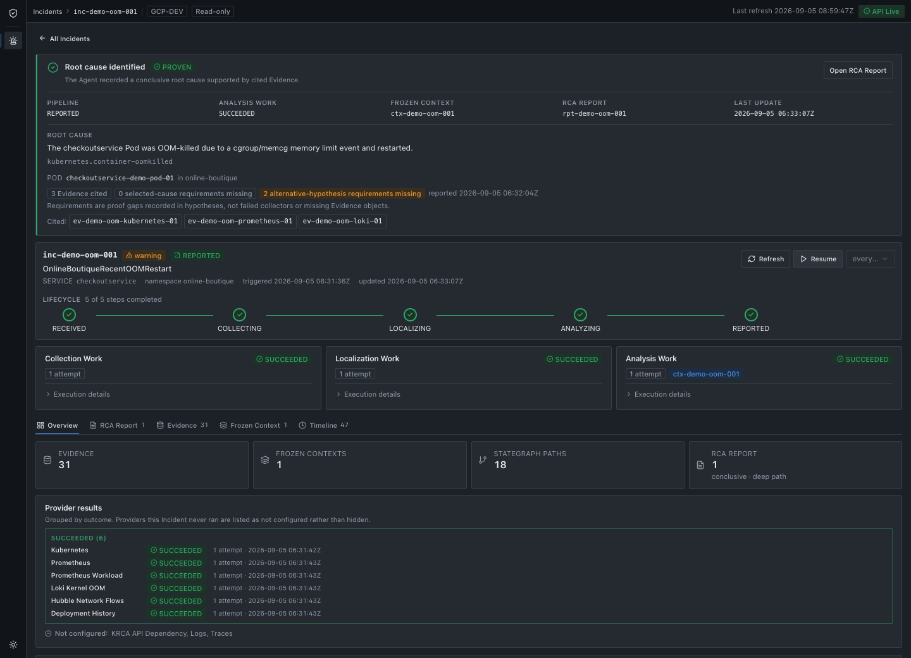
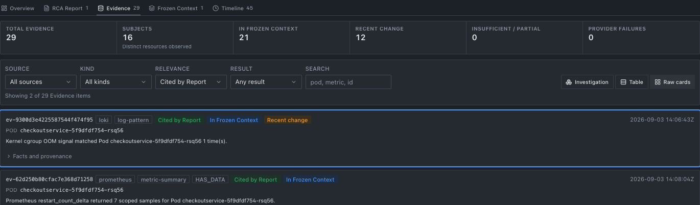
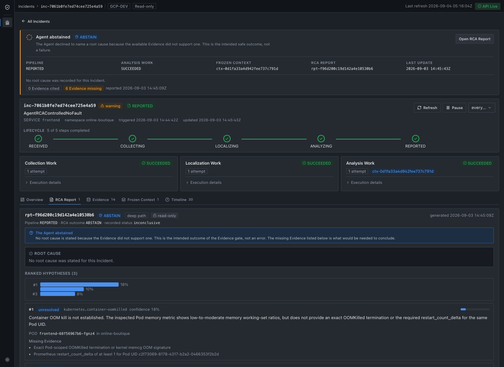
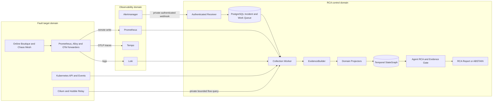

# Agent RCA

> Evidence-grounded infrastructure incident analysis for Kubernetes and
> cloud-native systems.

[](https://github.com/kyunghoon02/agent-RCA/actions/workflows/ci.yml)

## Problem

Cloud-native 장애의 원인은 metric 하나나 log 한 줄에만 있지 않다. 배포 변경,
workload, metric, log, trace, Kubernetes Event와 network flow를 같은 Incident time
window 안에서 함께 확인해야 한다. 일반적인 LLM 요약은 시간상 가까운 변경이나 운영
문서를 실제 원인 Evidence로 오인할 수도 있다.

Agent RCA는 Incident scope를 먼저 고정하고, 여러 관측 소스의 데이터를 검증된
`EvidenceItem`으로 정규화한다. 이후 [KRCA-style drilldown](contracts/krca-drilldown.md),
즉 KRCA 논문에서 차용한 API-level failure/latency propagation 분석과 Temporal
StateGraph가 조사 범위를 줄이고, bounded read-only Agent가 그 범위 안에서 Evidence를
검사한다. 이 프로젝트는 KRCA 논문의 전체 시스템이 아니라 이 drilldown 범위만 구현한다.
모든 결론은 실제 `evidence_id`로 추적하며, 근거가 부족하거나 충돌하면 추측하지 않고
`ABSTAIN`한다.

## How It Decides

`Frozen Context`는 분석 시작 시점에 선택한 Entity, Graph 경로, Evidence와 누락 source를
고정한 변경 불가능한 Incident snapshot이다. 따라서 live cluster 상태가 나중에 바뀌어도
Agent가 무엇을 보고 판단했는지 재현할 수 있다.

`Evidence Gate`는 Agent가 고른 원인과 인용한 `evidence_id`가 이 snapshot 안에 있고,
원인별 필수 증명 조건을 만족하는지 다시 검사한다. 통과하면 Report를 저장하고, 근거가
부족하거나 충돌하면 원인을 추측하지 않고 `ABSTAIN`을 저장한다.

## Runtime Walkthrough

아래 화면은 fixture가 아니라 GCP reference runtime에서 controlled evaluation으로 생성해
저장한 read-only Incident artifact다. 공개 캡처에서는 runtime identifier만 일관된 별칭으로
치환하며, Report 판정과 Evidence 관계는 바꾸지 않는다.



OOM 결론은 Loki의 kernel cgroup OOM 신호와 Prometheus의 Pod restart 증가를 인용하며,
전체 Incident lifecycle과 `PROVEN` 판정을 같은 화면에서 추적할 수 있다. 화면 상단의
`4 Evidence missing`은 확정된 OOM 원인이 아니라 배제된 하위 가설의 미충족 증명 조건이다.



Report가 실제 인용한 Evidence만 필터링하면 Loki의 kernel cgroup OOM 신호와 Prometheus의
Pod restart 증가가 동일한 Frozen Context에 포함된 것을 확인할 수 있다.



no-fault control에서는 분석 작업 자체는 정상 완료되지만, 원인별 증명 조건을 만족하지 않아
root cause를 만들지 않고 `ABSTAIN`한다.

## Architecture

> 논리 아키텍처는 cloud-neutral이며, 현재 reference runtime은 GCP Compute Engine의
> 독립된 single-node kubeadm Kubernetes 세 개다.



Alert 수신과 LLM 실행은 분리돼 있다. `rca_enabled=true`는 Alertmanager가 RCA 대상
Incident만 webhook으로 전달하게 하고, `agent_rca_enabled=true`는 연속 Agent Worker가
해당 Incident의 analysis work를 자동 claim할 수 있게 한다. Receiver는 Provider를 직접
호출하지 않고 PostgreSQL에 durable work를 먼저 저장하므로, Alertmanager 응답과 Evidence
수집 실패가 서로 영향을 주지 않는다.

## Core Components

| Component | Input | Responsibility | Output |
|---|---|---|---|
| Alert Receiver | Alertmanager webhook | 인증, payload 검증, 정규화, 중복 제거 | `RECEIVED` Incident와 collection work |
| Incident Workers | PostgreSQL work row | lease/fencing 기반 claim과 lifecycle 진행 | collection/localization result |
| Providers | Incident scope와 time window | bounded read-only telemetry 조회 | `EvidenceDraft` batch |
| EvidenceBuilder | Provider draft | scope, provenance, redaction, hash, schema 검증 | immutable `EvidenceItem` |
| Projectors | validated Evidence | domain Evidence를 temporal Entity와 relation으로 변환 | versioned Graph records |
| StateGraph and Resolver | Graph records와 Incident source | exact Entity resolution과 bounded localization | `Frozen Context` |
| Agent RCA Orchestrator | Frozen Context | Evidence 후보 선택과 bounded read-only tool investigation | structured RCA draft |
| Evidence Gate | Agent draft와 inspected Evidence | citation, scope와 원인별 등록 Evidence 조건 재검증 | Report 또는 `ABSTAIN` |
| Viewer | 저장된 Incident artifacts | Incident, Evidence, Context, work와 Report 조회 | read-only UI/API |

Provider가 Graph record를 직접 만들지는 않는다. 모든 Provider output은
`EvidenceBuilder`를 통과한 후에만 저장되고, domain Projector만 검증된 Evidence를
StateGraph record로 변환한다. Persistent graph는 JSON 파일이 아니라 Neo4j에 저장하며,
상위 service와 Agent는 Cypher를 직접 실행하지 않는다.

## Evidence Sources

| Source | 현재 Incident 경로 | 역할 |
|---|---|---|
| Prometheus | 연결됨 | service 오류율·latency, Pod memory ratio와 restart delta, KRCA API dependency feature |
| Kubernetes API | 연결됨 | Service, Deployment, ReplicaSet, Pod와 EndpointSlice 상태 |
| Kubernetes Event | 연결됨 | OOM, scheduling, mount, image pull 등 resource Event |
| Loki/Alloy | 부분 연결 | Pod UID에 귀속된 kernel memcg OOM Evidence |
| Deployment history | 연결됨 | retained ReplicaSet 기반 image/resource 변경과 변경 부재 |
| Tempo | telemetry 검증 연결 | trace 저장과 service graph 생성, Incident trace Provider는 미연결 |
| Cilium/Hubble | 연결됨 | namespace·Pod root·time window로 제한한 flow/verdict/drop 집계. 원본 flow, IP와 L7 payload는 저장하지 않음 |
| Application log | 계획 | 일반 application/container log Incident Provider는 미연결 |

새 Provider도 동일한 `EvidenceDraft → EvidenceBuilder → EvidenceItem` 경계를 사용한다.
새 오류 유형을 지원하려면 Provider뿐 아니라 schema, Projector, localization policy와
평가 scenario를 함께 추가해야 한다.

## Evidence and Safety Boundaries

| Layer | Role | Can prove root cause? |
|---|---|---|
| Runtime Evidence | metric, log, resource state, Event, flow와 change history | 가능, `evidence_id` 필수 |
| Graph Context | Evidence에서 파생된 Entity, relation과 time interval | 조사 범위 결정 |
| Operational Knowledge | versioned architecture, catalog, runbook과 SLO | 불가능, 조사 reference 전용 |
| Incident Memory | 검증된 과거 Incident와 일반화된 진단 경험 | 후속 단계, 현재 Evidence로 재검증 필요 |
| Ground Truth | fault fixture 정답과 평가 label | runtime 접근 금지 |

모든 Provider와 Agent tool은 다음 조건을 따른다.

- namespace, resource와 Incident time window를 벗어난 query를 거부한다.
- write/admin tool, 자동 복구와 LLM 생성 shell 또는 `kubectl` 실행을 허용하지 않는다.
- 원본 telemetry는 source retention에 두고 Evidence에는 필요한 요약과 provenance만 저장한다.
- no data, timeout, 권한 거부와 Provider failure를 구분한다. source retention을 입증할 수
  없는 no-data 결과는 완전한 성공으로 취급하지 않는다.
- 일부 Provider가 실패해도 성공한 Evidence를 보존하고 불완전성을 Report에 표시한다.
- root cause는 등록된 원인별 증명 조건을 만족하는 runtime Evidence 인용 없이는 확정할 수 없다.

## Reference Runtime

| Layer | Implementation |
|---|---|
| Cloud | Google Cloud Compute Engine |
| Kubernetes | upstream Kubernetes, failure domain별 kubeadm single-node bootstrap |
| Container and network | containerd, Cilium CNI와 Hubble |
| Observability | Prometheus, Alertmanager, Grafana, Loki/Alloy, Tempo와 OTel Collector |
| Persistence | PostgreSQL 17.6, Neo4j Community와 local-path PVC |
| Reference workload | [Google Online Boutique](platform/online-boutique/README.md) `v0.10.6` |
| Provisioning | Terraform이 GCP foundation, Ansible이 host/cluster와 pinned workload 배포 담당 |

실제 reference runtime은 독립된 single-node Kubernetes 세 개로 나뉜다.

| Failure domain | Active responsibility |
|---|---|
| RCA control | Receiver, PostgreSQL queue, Evidence/Agent workers, Neo4j StateGraph, Viewer |
| Fault target | Online Boutique, Chaos Mesh, Kubernetes/Cilium Evidence source, telemetry forwarders |
| Observability | authoritative Prometheus, Alertmanager, Grafana, Loki와 Tempo |

도메인 간 endpoint는 public ingress가 아니라 GCP VPC의 tag 기반 firewall과 고정 private
NodePort만 사용한다. RCA worker의 Kubernetes credential은 fault target에서 발급한 read-only
ServiceAccount이며 Secret 읽기는 거부된다. 전환 전에 존재하던 fault-target control plane과
control-domain Online Boutique는 삭제하지 않고 `0 replicas`로 내렸고 PVC는 보존했다.

Chaos evaluation은 기존 v1.36 runtime을 제자리에서 내리지 않는다. Terraform의 기본값이
꺼진 병렬 VM을 명시적으로 생성해 Kubernetes v1.35.8을 부트스트랩했고, Chaos Mesh 2.8.4는
`online-boutique`만 대상으로 하는 namespace-scoped mode로 설치했다. checkoutservice
OOM과 missing ConfigMap, paymentservice ImagePullBackOff를 통제 실행으로 end-to-end
재현하고 자동 복구했으며, 현재 활성 fault는 0개다. fault 실행은 별도 scenario 검토와
`CONFIRM_CONTROLLED_FAULT=yes` 승인을 요구한다.

이 runtime은 application/Kubernetes/Cilium fault 실험용이다. 각 failure domain이 여전히
single-node이므로 production HA, zone 장애와 managed control-plane 장애를 증명하지 않는다.
PostgreSQL, Neo4j와 telemetry PVC는 각 VM disk에 묶여 있으며 `Retain`은 backup이 아니다.

## Evaluation

평가는 실제 Kubernetes runtime에서 재현한 `Change × Workload` Incident를 사용한다.
Ground Truth는 Agent runtime과 격리하고, 완료된 Prediction에만 결합해 accuracy,
Evidence precision/recall, `ABSTAIN` correctness, latency와 LLM/tool cost를 계산한다.

| Evaluation boundary | Result | Interpretation |
|---|---|---|
| Historical frozen matrix, 4 scenarios × 5 | harness 20/20, expected outcome 9/20, fault Top-1 4/15, no-fault `ABSTAIN` 5/5, unsupported citation 0 | Agent/Gate interface failures를 포함한 수정 전 baseline |
| Corrected frozen matrix, 4 scenarios × 5 | harness 20/20, expected outcome 20/20, fault Top-1 15/15, no-fault `ABSTAIN` 5/5, unsupported citation 0 | 동일 runtime의 등록 regression set 결과이며 production 일반화 수치가 아님 |
| Holdout v1 and temporal replication, 각 12회 | 최초 12/12; 독립 재실행 11/12, fault Top-1 8/9, no-fault `ABSTAIN` 3/3, unsupported citation 0 | 같은 원인 taxonomy의 미사용 surface variant 결과. 재실행 1건은 schema 위반으로 fail-closed |
| Strict structured-output check, 4 scenarios × 2 | `REPORT_ACCEPTED` 8/8, model failure 0, draft contract rejection 0, expected outcome 8/8, unsupported citation 0 | 알려진 scenario를 재사용한 작은 표본의 output-contract 검증이며 정확도·일반화 수치가 아님 |

실패 artifact를 성공으로 재분류하지 않고 원인을 추적해 Gate reason code, UID-bounded
Kubernetes Event, short Evidence reference와 Context completeness decision policy를
보완했다. 수정 후 20회와 별도로 Holdout 12회를 실행했고, Agent·Gate를 바꾸지 않은 temporal
replication 12회도 다시 수행했다. 최초 Holdout은 12/12였지만 replication은 11/12였으며,
실패 1건을 재실행하거나 성공으로 재분류하지 않았다. 두 matrix 종료 후 모든 target workload의
Ready 상태와 fault cleanup을 확인했다. Holdout에서는 중립 Alert metadata를 사용하고 Ground
Truth를 Agent 실행 이후에만 결합했다. 이 결과는 등록된 단일 원인 fault 세 종류와 no-fault 한
종류에만 적용한다. 수치, 실패 분석, 수정 경계와 재현 명령은
[Evaluation and Reliability Record](evaluation/REPORT.md)에 기록한다. 평가 계약의 source of
truth는 regression용 [Evaluation Preregistration](evaluation/preregistration.yaml)과
독립 holdout용 [Holdout v1 Preregistration](evaluation/holdout-v1-preregistration.yaml)이다.

## Known Limitations

- 세 failure domain은 분리됐지만 각 도메인은 single-node이며 observability domain 자체는 HA가 아니다.
- VM1의 기존 observability stack은 control-plane queue/dashboard 관측용 shadow로 남아 있다.
  control telemetry까지 VM3로 통합한 뒤 제거 여부를 별도로 결정해야 한다.
- fault target의 `forwarder` profile도 전환기에는 base Prometheus/Loki/Tempo/Grafana
  구성 요소를 유지한다. target telemetry의 authoritative 저장·조회는 VM3지만,
  경량 forwarder-only profile과 기존 local telemetry PVC 정리는 후속 작업이다.
- PostgreSQL, Neo4j와 local PV의 backup/restore 및 HA가 구현되지 않았다.
- fault-target 원격 조회 credential은 제한된 RBAC의 장기 ServiceAccount token이며,
  production workload identity와 자동 rotation은 아직 구현되지 않았다.
- 일반 application log와 trace를 Incident Evidence로 수집하는 Provider가 없다.
- Hubble Relay의 bounded buffer가 Incident 전체 window를 보존했는지는 현재 입증할 수 없다.
  따라서 matching flow가 없으면 `PARTIAL`과 retention `UNKNOWN`으로 남긴다.
- fault-target Hubble Relay는 public endpoint가 아닌 VPC 내부 제한 NodePort지만, Relay
  구간의 mTLS는 아직 구성하지 않았다.
- Prometheus alert rule은 있지만 실제 운영 notification channel은 아직 연결하지 않았다.
- public Viewer ingress, session authentication과 role authorization이 없다.
- 현재 root-cause taxonomy는 OOMKilled, image pull failure와 missing ConfigMap 세 종류만 등록돼 있다.
- 수정 후 반복 matrix는 한 reference environment의 등록 scenario당 5개 표본이다.
- Holdout v1도 같은 세 cause family의 surface variant를 같은 reference environment에서 각각
  한 번 실행한 결과다. 알려지지 않은 장애, multi-factor 원인, 다른 cluster topology와
  production 정확도는 검증하지 않았다.
- temporal replication에서 Evidence 선택은 정확했지만 LLM draft schema 위반 1건이
  fail-closed됐다. 당시 감사 record에는 validation 좌표가 없어 그 과거 실패 field는 사후
  구분할 수 없다. 현재 새 실패는 원본 draft나 값을 저장하지 않고 JSON/schema Pointer와
  keyword만 audit와 Viewer에 남긴다. 후속 strict structured output 검증은 등록 scenario
  4개를 2회씩 실행해 계약 위반 없이 8/8을 기록했지만, 작은 재사용 표본이므로 장기
  production reliability를 입증하지 않는다.
- 자동 remediation은 의도적으로 지원하지 않는다.

## Quick Start

로컬 contract, 문서 링크와 core test:

```bash
make bootstrap-dev
make validate-docs
make validate-core
```

CI는 임시 PostgreSQL 17.6에서 repository 통합 테스트와 Viewer 검색·pagination도 검증한다.
로컬 통합 테스트는 별도 테스트 DB를 `POSTGRES_TEST_DSN`으로 지정할 때 실행한다.

GCP foundation 생성은 [GCP Infrastructure](infra/terraform/README.md), kubeadm/Cilium과
세 failure domain 배포·검증은
[Kubernetes Bootstrap and Deployment](automation/ansible/README.md)를 따른다. workload와
telemetry 설정은 각각 [Online Boutique target](platform/online-boutique/README.md)과
[Observability stack](platform/observability/README.md)에 기록한다.

Controlled evaluation은 development runtime과 명시적 승인에서만 실행한다. Ground Truth
격리, fault cleanup, 반복·holdout 절차와 재현 명령은
[Evaluation and Reliability Record](evaluation/REPORT.md)가 담당한다. Viewer는 public
Ingress 없이 RCA control cluster의 `ClusterIP`로만 배포하며, private access와 API 경계는
[Viewer Contract](contracts/viewer.md)에서 확인한다.

## Repository Structure

```text
automation/          kubeadm과 platform 배포 Ansible
config/              project scope, readiness와 RCA routing policy
contracts/           Incident, Evidence, Graph, RCA와 Provider contract
db/                  PostgreSQL와 opt-in pgvector migration
evaluation/          preregistration, scenario와 Ground Truth isolation policy
frontend/viewer/     read-only Incident/RCA Viewer
infra/terraform/     GCP VPC, IAM과 Compute Engine provisioning
knowledge/           versioned operational reference와 retrieval index
platform/            Kubernetes manifest와 Kustomize base
src/                 Incident, Evidence, StateGraph와 Agent RCA core
tests/               deterministic fixture와 contract test
tools/               validation, smoke와 evaluation tool
```

## Documentation

`README.md`는 현재 아키텍처와 구현 상태를 설명하고, `evaluation/REPORT.md`는 측정 결과와
claim boundary를 기록한다. `contracts/`와 `config/`는 machine-validated 규칙의 source of
truth이고, 하위 README는 해당 컴포넌트의 설치·실행 명령만 담당한다. 진행 기록과 roadmap은
별도 Markdown으로 복제하지 않으며, 변경 시 코드와 영향받는 contract를 같은 변경 단위에서
갱신한다. `make validate-docs`는 Git이 추적하는 Markdown의 로컬 경로와 외부 링크를 검사한다.

- [Provider Contract](contracts/providers.md)
- [Evidence Contract](contracts/schemas/evidence-item.schema.json)
- [KRCA-style API Drilldown](contracts/krca-drilldown.md)
- [Temporal StateGraph Model](contracts/graph/stategraph-model.yaml)
- [Viewer Contract](contracts/viewer.md)
- [Agent RCA Runtime Scope](config/project-scope.yaml)
- [Evaluation and Reliability Record](evaluation/REPORT.md)
- [Evaluation Preregistration](evaluation/preregistration.yaml)
- [Holdout v1 Preregistration](evaluation/holdout-v1-preregistration.yaml)
- [GCP Infrastructure](infra/terraform/README.md)
- [Kubernetes Bootstrap and Deployment](automation/ansible/README.md)
