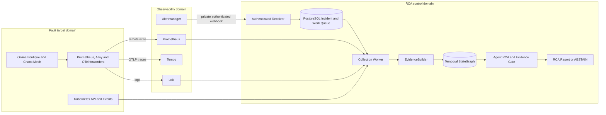

# Agent RCA

> Evidence-grounded infrastructure incident analysis for Kubernetes and
> cloud-native systems.

## Problem

Cloud-native 장애의 원인은 metric 하나나 log 한 줄에만 있지 않다. 배포 변경,
workload, metric, log, trace, Kubernetes Event와 network flow를 같은 Incident time
window 안에서 함께 확인해야 한다. 일반적인 LLM 요약은 시간상 가까운 변경이나 운영
문서를 실제 원인 Evidence로 오인할 수도 있다.

Agent RCA는 Incident scope를 먼저 고정하고, 여러 관측 소스의 데이터를 검증된
`EvidenceItem`으로 정규화한다. 이후 KRCA와 Temporal StateGraph가 조사 범위를 줄이고,
bounded read-only Agent가 그 범위 안에서 Evidence를 검사한다. 모든 결론은 실제
`evidence_id`로 추적하며, 근거가 부족하거나 충돌하면 추측하지 않고 `ABSTAIN`한다.

## Architecture

> 논리 아키텍처는 cloud-neutral이며, 현재 reference runtime은 GCP Compute Engine의
> 독립된 single-node kubeadm Kubernetes 세 개다.



Alert 수신과 LLM 실행은 분리돼 있다. `rca_enabled=true`는 Alertmanager가 RCA 대상
Incident만 webhook으로 전달하게 하고, `agent_rca_enabled=true`는 연속 Agent Worker가
해당 Incident의 analysis work를 자동 claim할 수 있게 한다. Receiver는 Provider를 직접
호출하지 않고 PostgreSQL에 durable work를 먼저 저장하므로, Alertmanager 응답과 Evidence
수집 실패가 서로 영향을 주지 않는다.

## Core Components

| Component | Input | Responsibility | Output |
|---|---|---|---|
| Alert Receiver | Alertmanager webhook | 인증, payload 검증, 정규화, 중복 제거 | `RECEIVED` Incident와 collection work |
| Incident Workers | PostgreSQL work row | lease/fencing 기반 claim과 lifecycle 진행 | collection/localization result |
| Providers | Incident scope와 time window | bounded read-only telemetry 조회 | `EvidenceDraft` batch |
| EvidenceBuilder | Provider draft | scope, provenance, redaction, hash, schema 검증 | immutable `EvidenceItem` |
| Projectors | validated Evidence | domain Evidence를 temporal Entity와 relation으로 변환 | versioned Graph records |
| StateGraph and Resolver | Graph records와 Incident source | exact Entity resolution과 bounded localization | `Frozen Context` |
| Agent RCA Orchestrator | Frozen Context | Evidence 후보 선택과 bounded read-only tool investigation | structured RCA draft |
| Evidence Gate | Agent draft와 inspected Evidence | citation, scope, completeness와 consistency 재검증 | Report 또는 `ABSTAIN` |
| Viewer | 저장된 Incident artifacts | Incident, Evidence, Context, work와 Report 조회 | read-only UI/API |

Provider가 Graph record를 직접 만들지는 않는다. 모든 Provider output은
`EvidenceBuilder`를 통과한 후에만 저장되고, domain Projector만 검증된 Evidence를
StateGraph record로 변환한다. Persistent graph는 JSON 파일이 아니라 Neo4j에 저장하며,
상위 service와 Agent는 Cypher를 직접 실행하지 않는다.

## Evidence Sources

| Source | 현재 Incident 경로 | 역할 |
|---|---|---|
| Prometheus | 연결됨 | service 오류율·latency, Pod memory ratio와 restart delta, KRCA API dependency feature |
| Kubernetes API | 연결됨 | Service, Deployment, ReplicaSet, Pod와 EndpointSlice 상태 |
| Kubernetes Event | 연결됨 | OOM, scheduling, mount, image pull 등 resource Event |
| Loki/Alloy | 부분 연결 | Pod UID에 귀속된 kernel memcg OOM Evidence |
| Deployment history | 연결됨 | retained ReplicaSet 기반 image/resource 변경과 변경 부재 |
| Tempo | telemetry 검증 연결 | trace 저장과 service graph 생성, Incident trace Provider는 미연결 |
| Cilium/Hubble | platform 조회 가능 | flow/drop/policy-verdict Incident Provider는 미연결 |
| Application log | 계획 | 일반 application/container log Incident Provider는 미연결 |

새 Provider도 동일한 `EvidenceDraft → EvidenceBuilder → EvidenceItem` 경계를 사용한다.
새 오류 유형을 지원하려면 Provider뿐 아니라 schema, Projector, localization policy와
평가 scenario를 함께 추가해야 한다.

## Evidence and Safety Boundaries

| Layer | Role | Can prove root cause? |
|---|---|---|
| Runtime Evidence | metric, log, resource state, Event, flow와 change history | 가능, `evidence_id` 필수 |
| Graph Context | Evidence에서 파생된 Entity, relation과 time interval | 조사 범위 결정 |
| Operational Knowledge | versioned architecture, catalog, runbook과 SLO | 불가능, 조사 reference 전용 |
| Incident Memory | 검증된 과거 Incident와 일반화된 진단 경험 | 후속 단계, 현재 Evidence로 재검증 필요 |
| Ground Truth | fault fixture 정답과 평가 label | runtime 접근 금지 |

모든 Provider와 Agent tool은 다음 조건을 따른다.

- namespace, resource와 Incident time window를 벗어난 query를 거부한다.
- write/admin tool, 자동 복구와 LLM 생성 shell 또는 `kubectl` 실행을 허용하지 않는다.
- 원본 telemetry는 source retention에 두고 Evidence에는 필요한 요약과 provenance만 저장한다.
- no data, retention expiry, timeout, 권한 거부와 Provider failure를 구분한다.
- 일부 Provider가 실패해도 성공한 Evidence를 보존하고 불완전성을 Report에 표시한다.
- root cause는 runtime Evidence 인용 없이는 확정할 수 없다.

## Reference Runtime

| Layer | Implementation |
|---|---|
| Cloud | Google Cloud Compute Engine |
| Kubernetes | upstream Kubernetes, failure domain별 kubeadm single-node bootstrap |
| Container and network | containerd, Cilium CNI와 Hubble |
| Observability | Prometheus, Alertmanager, Grafana, Loki/Alloy, Tempo와 OTel Collector |
| Persistence | PostgreSQL 17.6, Neo4j Community와 local-path PVC |
| Reference workload | [Google Online Boutique](platform/online-boutique/README.md) `v0.10.6` |
| Provisioning | Terraform이 GCP foundation, Ansible이 host/cluster와 pinned workload 배포 담당 |

실제 reference runtime은 독립된 single-node Kubernetes 세 개로 나뉜다.

| Failure domain | Active responsibility |
|---|---|
| RCA control | Receiver, PostgreSQL queue, Evidence/Agent workers, Neo4j StateGraph, Viewer |
| Fault target | Online Boutique, Chaos Mesh, Kubernetes/Cilium Evidence source, telemetry forwarders |
| Observability | authoritative Prometheus, Alertmanager, Grafana, Loki와 Tempo |

도메인 간 endpoint는 public ingress가 아니라 GCP VPC의 tag 기반 firewall과 고정 private
NodePort만 사용한다. RCA worker의 Kubernetes credential은 fault target에서 발급한 read-only
ServiceAccount이며 Secret 읽기는 거부된다. 전환 전에 존재하던 fault-target control plane과
control-domain Online Boutique는 삭제하지 않고 `0 replicas`로 내렸고 PVC는 보존했다.

Chaos evaluation은 기존 v1.36 runtime을 제자리에서 내리지 않는다. Terraform의 기본값이
꺼진 병렬 VM을 명시적으로 생성해 Kubernetes v1.35.8을 부트스트랩했고, Chaos Mesh 2.8.4는
`online-boutique`만 대상으로 하는 namespace-scoped mode로 설치했다. 현재 모든 Chaos Mesh
구성 요소는 Ready이고 활성 fault는 0개다. fault 실행은 별도 scenario 검토와
`CONFIRM_CONTROLLED_FAULT=yes` 승인을 요구한다.

이 runtime은 application/Kubernetes/Cilium fault 실험용이다. 각 failure domain이 여전히
single-node이므로 production HA, zone 장애와 managed control-plane 장애를 증명하지 않는다.
PostgreSQL, Neo4j와 telemetry PVC는 각 VM disk에 묶여 있으며 `Retain`은 backup이 아니다.

## Evaluation

평가는 실제 Kubernetes runtime에서 재현한 `Change × Workload` Incident를 사용한다.
Ground Truth는 Agent runtime과 격리하고, 완료된 Prediction에만 결합해 accuracy,
Evidence precision/recall, `ABSTAIN` correctness, latency와 LLM/tool cost를 계산한다.

| Representative scenario | Evidence focus | Status |
|---|---|---|
| `checkoutservice` OOMKilled | kernel memcg OOM, same-UID restart, resource limit | v1 고정 scenario 5회 false negative 분석, v2 live 확인 1회 Top-1 `1.0` |
| NetworkPolicy regression | Hubble drop, policy verdict와 change time | 계획 |
| Deployment regression | RED metric, trace, log와 ReplicaSet revision | 계획 |
| Load-only saturation | latency/error, CPU·memory와 change 부재 | 계획 |

OOM v1 결과는 순간 memory metric을 필수 조건으로 사용하면 실제 kernel OOM을 놓칠 수
있음을 보여줬다. v2는 exact kernel signature와 same-UID restart를 필수 Evidence로 사용하며,
memory ratio는 보조 관측으로 남긴다. 목표 평가는 최소 15개 scenario를 각각 5회 반복하는
것이며, 현재 한 번의 v2 성공은 그 목표를 달성한 결과가 아니다.

상세 규칙은 [Evaluation Preregistration](evaluation/preregistration.yaml)과
[KRCA Drilldown Contract](contracts/krca-drilldown.md)에 기록한다.

## Known Limitations

- 세 failure domain은 분리됐지만 각 도메인은 single-node이며 observability domain 자체는 HA가 아니다.
- VM1의 기존 observability stack은 control-plane queue/dashboard 관측용 shadow로 남아 있다.
  control telemetry까지 VM3로 통합한 뒤 제거 여부를 별도로 결정해야 한다.
- fault target의 `forwarder` profile도 전환기에는 base Prometheus/Loki/Tempo/Grafana
  구성 요소를 유지한다. target telemetry의 authoritative 저장·조회는 VM3지만,
  경량 forwarder-only profile과 기존 local telemetry PVC 정리는 후속 작업이다.
- PostgreSQL, Neo4j와 local PV의 backup/restore 및 HA가 구현되지 않았다.
- fault-target 원격 조회 credential은 제한된 RBAC의 장기 ServiceAccount token이며,
  production workload identity와 자동 rotation은 아직 구현되지 않았다.
- Hubble flow, 일반 application log와 trace를 Incident Evidence로 수집하는 Provider가 없다.
- Prometheus alert rule은 있지만 실제 운영 notification channel은 아직 연결하지 않았다.
- public Viewer ingress, session authentication과 role authorization이 없다.
- OOM 외 fault matrix와 반복 평가가 완료되지 않았다.
- Chaos Mesh runtime은 배포됐지만 Chaos CR 기반 fault scenario와 반복 평가는 아직 실행하지 않았다.
- 자동 remediation은 의도적으로 지원하지 않는다.

## Quick Start

로컬 contract와 core test:

```bash
make bootstrap-dev
make validate-core
```

manifest와 Ansible 정적 검증:

```bash
make terraform-validate
make ansible-syntax
make render-observability
make render-chaos-mesh
make render-stategraph
make render-incident-platform
make render-viewer-frontend
```

구성된 development inventory에 배포하고 검증:

```bash
make deploy-stategraph
make deploy-incident-platform
make verify-incident-platform
make deploy-viewer-frontend
make verify-viewer-frontend
make deploy-three-domain
```

Controlled fault는 development 환경에서만 명시적으로 승인해 실행한다.

```bash
make evaluate-checkout-oom CONFIRM_CONTROLLED_FAULT=yes
```

배포된 Viewer frontend와 API는 RCA control cluster의 `ClusterIP`로만 노출된다.
Ingress, NodePort와 LoadBalancer는 만들지 않으며, browser에는 API bearer token을
노출하지 않는다. 로컬에서 확인할 때는 RCA control VM을 거치는 다음 SSH tunnel만
열고 `http://127.0.0.1:13100`에 접속한다.

```bash
ssh -i ~/.ssh/google_compute_engine \
  -L 13100:127.0.0.1:13100 \
  <VM_USER>@<RCA_CONTROL_PUBLIC_IP> \
  'sudo kubectl --kubeconfig=/etc/kubernetes/admin.conf \
    --namespace incident-platform port-forward \
    service/incident-viewer-frontend 13100:3100 --address=127.0.0.1'
```

이 tunnel은 Viewer frontend에만 도달한다. frontend의 same-origin BFF가 cluster 내부
Viewer API를 호출하므로 별도의 로컬 API tunnel이나 browser token 설정은 필요 없다.

## Repository Structure

```text
automation/          kubeadm과 platform 배포 Ansible
config/              project scope, readiness와 RCA routing policy
contracts/           Incident, Evidence, Graph, RCA와 Provider contract
db/                  PostgreSQL와 opt-in pgvector migration
docs/                architecture decision, runtime evidence와 reproduction guide
evaluation/          preregistration, scenario와 Ground Truth isolation policy
frontend/viewer/     read-only Incident/RCA Viewer
infra/terraform/     GCP VPC, IAM과 Compute Engine provisioning
knowledge/           versioned operational reference와 retrieval index
platform/            Kubernetes manifest와 Kustomize base
src/                 Incident, Evidence, StateGraph와 Agent RCA core
tests/               deterministic fixture와 contract test
tools/               validation, smoke와 evaluation tool
```

## Documentation

- [Provider Contract](contracts/providers.md)
- [Evidence Contract](contracts/schemas/evidence-item.schema.json)
- [KRCA-style API Drilldown](contracts/krca-drilldown.md)
- [Temporal StateGraph Model](contracts/graph/stategraph-model.yaml)
- [Viewer Contract](contracts/viewer.md)
- [Agent RCA Runtime Scope](config/project-scope.yaml)
- [Evaluation Preregistration](evaluation/preregistration.yaml)
- [GCP Infrastructure](infra/terraform/README.md)
- [Kubernetes Bootstrap and Deployment](automation/ansible/README.md)
