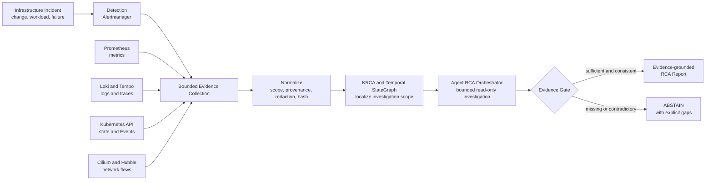
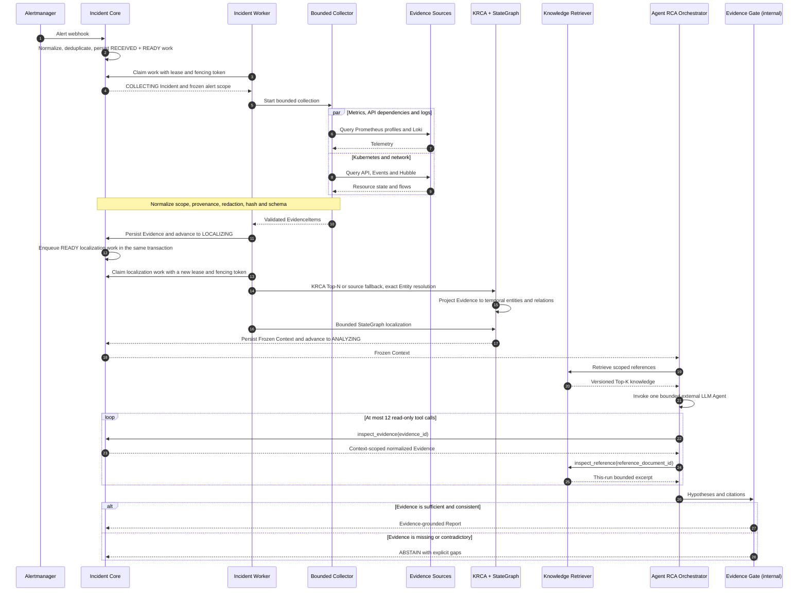

# Agent RCA

> Evidence-grounded infrastructure incident analysis for Kubernetes and
> cloud-native systems.

## Problem

Cloud-native 장애의 원인은 metric 하나나 log 한 줄에만 있지 않다. 배포 변경, workload,
Prometheus metric, log, trace, Kubernetes Event와 Cilium/Hubble network flow를 같은
Incident time window 안에서 함께 봐야 한다. 일반적인 LLM 요약은 운영 지식이나 시간상
가까운 변경을 실제 원인 증거로 오인할 수도 있다.

Agent RCA는 Incident scope를 먼저 고정하고, 여러 관측 소스의 데이터를 검증된
`EvidenceItem`으로 정규화한 뒤 관련 service와 Entity만 localization한다. 하나의 bounded
read-only Agent가 이 Context 안에서 Evidence를 조사하고, 모든 결론은 실제
`evidence_id`로 추적한다. Orchestrator 내부의 deterministic `Evidence Gate`가 근거와
scope를 다시 검사하며, Evidence가 부족하거나 충돌하면 원인을 추측하지 않고
`ABSTAIN`한다.

## How Agent RCA Works



이 프로젝트에서 Agent는 log를 받아 답을 생성하는 독립된 wrapper가 아니다. 실제
인프라 Evidence를 제한된 범위에서 조사하는 진단 구성요소다. 현재 RCA 경로는
read-only이며 write/admin tool과 자동 복구는 허용하지 않는다. 복구가 필요하면 운영자가
Report를 검토해 별도로 수행하고, 정상화 여부는 새로운 runtime Evidence로 다시
검증해야 한다.

## Verified Scope

- **Infrastructure runtime:** Terraform과 Ansible로 GCP 단일 VM, kubeadm Kubernetes,
  Cilium/Hubble과 observability stack을 구성하고 재부팅 후 복구 및 주요 component
  readiness를 검증했다.
- **Live telemetry path:** Online Boutique의 실제 trace와 Prometheus recording rule을
  normalized metric Evidence와 KRCA drilldown까지 연결한 live smoke를 확인했다.
- **Live Incident collection and localization:** `rca_enabled=true`인 제어 경보가
  Alertmanager의 인증된 내부 webhook을 거쳐 PostgreSQL에 저장되고, lease/fencing
  worker가 Kubernetes Service/Event, service metric과 선택된 KRCA API dependency
  profile Evidence를 수집한다. 이어서 KRCA feature를 logical Service의 `CALLS` 관계로
  projection하고, Top-N 또는 안전한 source fallback으로 Neo4j bounded StateGraph 탐색을
  실행해 Frozen Context를 저장하고 `ANALYZING`까지 전이한 뒤, exact `context_id`가 고정된
  analysis work를 `READY`로 남기는 경로를 확인했다.
- **RCA core:** Incident/Evidence contract, bounded collector, localization, Context-pinned
  analysis claim, read-only Agent tool과 Evidence Gate는 fixture와 contract test로 검증했다.
- **아직 증명하지 않은 범위:** `ANALYZING` 이후 Agent Report까지의 cluster runtime,
  controlled fault에 대한 RCA 정확도, 성공한 external LLM live run과 자동 복구는 아직
  검증하지 않았다.

세부 구현과 runtime 상태는 [Implementation Status](#implementation-status)에서 분리해 기록한다.

## Target Architecture


> Cloud-neutral logical architecture이며, single-node kubeadm Kubernetes는 현재
> reference runtime이다.

## Incident Investigation Flow



KRCA-style API Drilldown은 failure-rate와 latency propagation으로 Top-N service
seed를 만들고, Temporal StateGraph는 관련 Entity와 시간 구간만 `Frozen Context`로
고정한다. Operational Knowledge는 localized Entity 범위 안의 조사 reference로만
사용하며 root cause는 실제 `evidence_id` 없이는 확정하지 않는다.

## Evidence and Safety Boundaries

| 입력 계층 | 역할 | 원인 증명 가능 여부 |
|---|---|---|
| Runtime Evidence | metric, log, resource state, Event, network flow와 change history | 가능, `evidence_id` 필수 |
| Graph Context | Evidence에서 파생된 Entity, 상태·관계와 시간 구간 | 조사 범위 결정 |
| Operational Knowledge | versioned architecture, catalog, runbook과 SLO | 불가능, 조사 reference 전용 |
| Incident Memory | 검증된 과거 Incident와 일반화된 진단 경험 | 후속 단계, runtime Evidence로 재검증 필요 |
| Ground Truth | fault fixture 정답과 평가 label | RCA runtime 접근 금지 |

모든 provider와 Agent tool은 다음 불변 조건을 따른다.

- namespace, resource와 Incident time window를 벗어난 query를 거부한다.
- write/admin tool, 자동 복구와 LLM이 생성한 shell 또는 `kubectl` 실행을 허용하지 않는다.
- 원본 telemetry는 source retention에 유지하고 Evidence에는 필요한 요약과 provenance만 저장한다.
- 검색 결과 없음, retention 만료, timeout, 권한 거부와 provider failure를 구분한다.
- 일부 collector가 실패해도 성공한 Evidence를 보존하고 불완전성을 Report에 표시한다.
- root cause는 runtime Evidence 인용 없이는 확정할 수 없다.

## Reference Runtime

- cloud: Google Cloud
- compute: Compute Engine `e2-standard-8` 단일 VM, 8 vCPU / 32GB memory
- Kubernetes: upstream Kubernetes, kubeadm single-node bootstrap
- container runtime: containerd
- dataplane and network evidence: Cilium CNI와 Hubble
- observability: Prometheus, Alertmanager, Grafana, Loki/Alloy, Tempo,
  OpenTelemetry Collector와 Kubernetes API/Event
- graph: Neo4j Community 기반 temporal StateGraph
- operational knowledge index: Git source + PostgreSQL/pgvector derived index
- reference workload: [Google Online Boutique](platform/online-boutique/README.md)
  `v0.10.6` controlled incident target
- state: versioning을 활성화한 사전 생성 GCS Terraform backend
- identity: 전용 최소 권한 VM service account
- RCA permission: Kubernetes와 observability source에 대한 bounded read-only access

Terraform은 VPC, subnet, firewall, IAM과 Compute Engine lifecycle까지만 소유한다.
Ansible은 containerd와 kubeadm host/cluster bootstrap을 소유하고, Ansible이 실행하는
고정 Helm release와 manifest가 Cilium/Hubble 및 observability stack을 설치한다. target
workload와 Agent RCA 배포는 그 다음 Kubernetes deployment 계층이 담당한다. Reference runtime은 교체할 수 있으며 RCA core와
Evidence contract는 GCP나 특정 workload ontology에 종속되지 않는다.

## Representative Incident Validation Plan

전체 평가는 최소 15개 Incident를 반복하지만, 포트폴리오에서는 다음 4개 scenario를
깊이 있는 case study로 먼저 제시한다. 아래 항목은 아직 성과값이 아니라 controlled
fault 실험 후보이며, 실제 runtime Evidence와 Ground Truth 비교가 끝난 결과만 완료로
표시한다.

| Scenario | Change × Workload | 수집할 핵심 Evidence | 검증할 원인 | 상태 |
|---|---|---|---|---|
| `checkoutservice` OOMKilled | memory limit 감소 × 고정 checkout traffic | memory metric, restart/OOMKilled Event, resource limit와 rollout 시각 | 변경과 workload가 결합한 memory exhaustion | 첫 실험 후보 |
| NetworkPolicy 차단 | policy 변경 × 정상 service traffic | Hubble drop flow, timeout, policy diff와 적용 시각 | 특정 service path를 차단한 policy regression | 계획 |
| Deployment regression | image/config 변경 × path-weighted traffic | RED metric, trace, application log와 ReplicaSet revision | 새 revision에서 발생한 API path regression | 계획 |
| Load-only saturation | 변경 없음 × 단계적 stress | latency/error, CPU·memory와 change 부재 Evidence | 배포 변경이 아닌 capacity/workload 문제 | 계획 |

각 case study는 fault 주입만 보여주지 않는다. baseline과 fault window, Agent가 실제로
검사한 `evidence_id`, Report 또는 `ABSTAIN`, Ground Truth 일치 여부, 진단 시간과 false
positive를 함께 기록한다. RCA core는 계속 read-only로 유지하며 operator remediation을
수행한 경우에도 recovery signal은 별도 post-action Evidence로 수집한다.

## Evaluation Strategy

Agent RCA는 공개 사용자 수가 아니라 실제 Kubernetes runtime에서 재현한
`Change × Workload` Incident로 평가한다. 변경이 잠재 결함을 만들고 특정 요청 경로,
동시성 또는 부하가 이를 드러내는 운영 상황을 중심으로 다음 네 실험 셀을 비교한다.

| Change | Workload | 평가 목적 |
|---|---|---|
| 없음 | normal | 정상 baseline과 false positive 측정 |
| 있음 | normal | 배포·설정 자체의 regression 분리 |
| 없음 | stress | 순수 traffic·capacity 문제 분리 |
| 있음 | stress | 변경과 workload가 결합된 Incident 평가 |

Change Evidence에는 Git commit과 manifest diff, Deployment/ReplicaSet revision, image
digest, ConfigMap metadata hash, resource limit, NetworkPolicy와 rollout/rollback 시각을
포함한다. Secret value는 수집하지 않으며 Change history만으로 root cause를 확정하지
않는다. 변경이 실제 metric, log, Event, trace 또는 Hubble flow 변화와 시간적·인과적으로
일치해야 한다.

대상 node의 resource signal을 오염시키지 않도록 load generator는 target node와 다른
failure domain에서 실행한다. baseline, spike, soak와 path-weighted workload마다 seed와
rate를 기록하고, 최소 15개 Incident scenario를 각각 5회 반복한다. 동일한 Frozen
Evidence는 A/B/C/D variant에 재사용하며 root-cause accuracy, Evidence precision/recall,
`ABSTAIN` correctness, latency, tool/LLM cost와 반복 재현성을 비교한다. Fault manifest와
Ground Truth는 Agent runtime에서 계속 격리한다.

### Knowledge Retrieval Ablation

Operational Knowledge 검색은 기존 `entity-key+lexical`을 baseline으로 유지하고 동일한
Frozen Context/query/corpus에서 `entity-key+vector`와
`entity-key+lexical+vector-rrf`를 비교한다. 승인 상태, 유효 기간, Entity 범위와 content
hash는 세 variant에서 동일한 hard filter로 고정하며 Vector 검색은 eligible 문서의
순위만 바꾼다.

| Variant | 목적 | 측정값 |
|---|---|---|
| Lexical | 기존 deterministic baseline | Hit@K, Recall@K, MRR@K, nDCG@K, p95 latency |
| Vector | semantic retrieval ablation | 동일 |
| Hybrid RRF | exact term과 semantic paraphrase 결합 | 동일 + lexical 대비 absolute delta |

현재 포함된 2개 문서/12개 query benchmark는 평가 pipeline pilot이며 정확도 개선
성과값이 아니다. 승인 문서 20개와 frozen query 30개 이상으로 확장한 뒤 생성되는
corpus/benchmark/model fingerprint가 있는 결과만 README의 portfolio 수치로 승격한다.

## Implementation Status

> 기준일: 2026-08-26. 목표 아키텍처와 현재 executable/runtime evidence를 구분한다.

| 영역 | 현재 상태 | Runtime 상태 |
|---|---|---|
| Incident lifecycle, Collector, Evidence, Fast Path Report | Alertmanager 정규화·중복 제거, 상태 전이, bounded HTTP receiver와 collection/localization/analysis fenced work repository를 구현하고 crash/reclaim 경계를 contract test로 검증 | authenticated webhook→`RECEIVED`→`COLLECTING`→Evidence 저장→`LOCALIZING`→KRCA-guided exact Entity resolve→Frozen Context 저장→`ANALYZING`→Context-pinned analysis work `READY`까지 live 연결. Agent Worker만 credit gate로 배포 비활성화 |
| Bounded HTTP, Prometheus, Kubernetes provider | adapter와 contract test 구현 | Incident worker가 Service-scoped Kubernetes Service/Event, 고정 allowlist Prometheus query 4개와 선택된 KRCA profile 전용 `prometheus-api` collector를 병렬 실행. 모든 summary는 trusted `cluster_id`와 함께 정규화된다. Loki, Hubble과 다른 Kubernetes kind의 Incident collector는 아직 미연결 |
| PostgreSQL repository | Incident artifact, fenced collection/localization/analysis work와 StateGraph observation journal migration/repository contract 구현 | cluster-local PostgreSQL 17.6 StatefulSet과 5Gi PVC에 migration 6개 적용. `ANALYZING`과 Frozen Context 생성 순서 모두에서 exact `context_id`를 고정하는 analysis work가 live 제어 Incident에 `READY`로 생성됨 |
| KRCA metric feature provider와 scorer | schema-validated PromQL/dependency profile, Evidence-to-Top-N과 profile completeness/fallback 구현 | browse/cart/checkout 3개 profile의 23개 edge가 active-traffic smoke에서 모두 `HAS_DATA`. Incident worker는 alert의 allowlisted `krca_profile`만 수집하며, 최근 traffic이 없던 제어 경보에서는 9개 edge를 `INSUFFICIENT_DATA`로 명시하고 source fallback을 선택해 근거 없는 Top-N 생성을 차단 |
| Entity resolver와 Temporal StateGraph | Kubernetes/Prometheus/KRCA Evidence Projector, observation journal, atomic complete-set Reconciler, Neo4j repository, exact resolver와 Frozen Context 구현 | cluster-local PostgreSQL journal과 Neo4j에 연결된 5분 Kubernetes CronJob 배포. `concurrencyPolicy=Forbid`로 직렬화하며 live cycle에서 66개 Evidence→304개 record→76개 current Entity/86개 current Relation 및 `APPLIED` journal을 검증. 제어 Incident는 9개 KRCA `CALLS` Evidence를 포함한 총 14개 Evidence, StateGraph path 40개를 Frozen Context에 저장하고 `ANALYZING` 도달 |
| Operational Knowledge와 Retriever | lexical baseline, pgvector chunk adapter, vector-only/Hybrid RRF, hash/scope gate, 12-query pilot harness와 Agent reference tool 구현 | live pgvector sync/embedding 평가와 claim-ready corpus 미검증 |
| Agent RCA와 LLM tool-calling | OpenAI Agents SDK 단일 Agent, 구조화 draft, Evidence/Reference read-only tool 2개, Evidence Gate, Agent Run audit/Report 저장과 별도 Context-pinned Agent Worker 구현 | Worker fixture는 `ANALYZING→REPORTED`와 fail-closed 경로를 통과. Agent Deployment manifest는 준비됐지만 기본 Kustomize에서 제외됨. 2026-08-25 live API 재확인도 `credit_balance_exhausted` 429로 성공 runtime 미검증 |
| Read-only RCA Viewer query | bounded list/filter/keyset cursor, artifact detail/timeline/work-state contract, 인증된 GET transport, Next.js UI와 same-origin server-side BFF, private API Deployment 및 전용 read-only DB role 구현 | cluster-local API Ready, DB role의 SELECT 허용·mutation 거부와 local BFF를 통한 live list/detail/work/Evidence 조회 검증. public ingress/domain, 사용자 session/role 인증, observability deep link runtime 설정과 production query plan은 미구현 |
| Change × Workload evaluation | preregistration과 matrix 정의 | harness, Change Provider와 runtime dataset 미구현 |
| GCP, Terraform, kubeadm, Cilium/Hubble | foundation apply와 재계획 검증, pinned Ansible kubeadm 및 Cilium/Hubble bootstrap 구현 | Compute Engine을 `e2-standard-8`(8 vCPU/32GB)로 확장하고 Kubernetes v1.36.4 single-node 재부팅 복구, Cilium/Hubble과 read-only flow 조회를 검증; destroy와 fault runtime 미검증 |
| Observability stack | pinned Helm values, Tempo manifest와 Ansible deploy/verify 구현 | Prometheus/Alertmanager/Grafana, Loki/Alloy, Tempo 배포; PVC 5개 Bound, Cilium/Hubble target `up=1`, normalized Kubernetes log stream과 Tempo readiness 확인. KRCA recording rule 4개, frontend failure-rate opt-in alert rule과 인증된 Alertmanager webhook live 적용 |
| Online Boutique target | upstream `v0.10.6` commit·Redis/Collector image를 고정하고, 3개 source patch와 Cloud Build/Artifact Registry digest pin을 추가한 Kustomize overlay 및 Ansible deploy/verify 구현 | 12 Deployment와 12 internal Service Ready. 10개 application service 모두 server span, Collector target `up=1`, RED/service graph metric, Tempo trace와 23-edge KRCA live smoke 검증 완료. 지속 외부 load와 fault evaluation은 미연결 |

Single-node reference runtime은 application/Kubernetes/Cilium fault 실험용이며
production HA, cross-node networking, node pool autoscaling, zone 장애 또는 managed
control-plane 장애를 증명하지 않는다. VM 장애까지 분석하려면 Agent control plane을
별도 failure domain으로 분리해야 한다.

현재 cluster에서 실제로 연결된 Incident 수집 경로는 다음과 같다.

```text
controlled alert or opt-in PrometheusRule with rca_enabled=true
→ AlertmanagerConfig의 exact label route
→ Bearer-authenticated private ClusterIP webhook
→ payload/body/alert-count 검증
→ Alertmanager normalization
→ fingerprint + startsAt + alert + source Entity 기반 deduplication key
→ PostgreSQL unique Incident insert + READY collection work insert (same transaction)
→ RECEIVED Incident + INCIDENT_CREATED audit
→ worker의 FOR UPDATE SKIP LOCKED claim + lease/fencing token
→ COLLECTING 전이
→ bounded Kubernetes Service/Event + Prometheus query 4개 병렬 수집
→ alert의 allowlisted krca_profile에 한해 격리된 API dependency range query 수집
→ EvidenceBuilder의 scope·provenance·redaction·hash·schema 검증
→ normalized Evidence 저장
→ LOCALIZING 전이 + READY localization work insert (same transaction)
→ collection work SUCCEEDED
→ localization worker의 FOR UPDATE SKIP LOCKED claim + 별도 lease/fencing token
→ KRCA feature status와 profile edge completeness 검증
→ HAS_DATA면 KRCA Top-N, 부족하면 exact source Service fallback
→ Kubernetes 상태, service metric Event와 API dependency CALLS를 temporal Graph record로 projection
→ Neo4j exact logical Service resolution
→ bounded time/domain/relation/entity/depth StateGraph 탐색
→ 현재 Incident의 14개 Evidence를 Frozen Context에 고정하고 ANALYZING 전이
→ 현재 Incident에 저장된 evidence_id만 남긴 Frozen Context 저장
→ ANALYZING 전이 + localization work SUCCEEDED
→ migration 6 trigger가 exact context_id가 고정된 READY analysis work 생성
→ [credit gate로 현재 비활성] 별도 Agent Worker claim → Evidence Gate → Report → REPORTED
```

webhook은 `observability` namespace에서만 접근 가능한 NetworkPolicy와 namespace-local
Secret을 사용하고 request body 1MiB, request당 alert 100개로 제한한다. 동일 alert의 재전송은
같은 deduplication key로 기존 Incident를 반환하며 새 감사 이벤트나 work row를 만들지
않는다. HTTP receiver가 Provider를 직접 호출하지 않고 먼저 durable queue에 기록하므로
Alertmanager 응답 시간과 Evidence 수집 실패를 분리한다. worker는 동시에 하나의 row만
claim하며 120초 lease, 최대 3회 시도와 매 claim마다 새 fencing token을 사용한다. lease가
만료된 stale worker는 최신 token 없이 완료나 실패를 저장할 수 없고, collection commit 뒤
work 완료만 누락된 경우 reaper가 Incident의 downstream 상태를 기준으로 terminal work 상태를
복구한다. collection과 localization은 서로 다른 table과 claim token을 사용하므로 한 단계의
stale worker가 다음 단계의 완료를 덮어쓸 수 없다. exact Entity가 없거나 여러 개면 임의로
선택하지 않고 Incident와 localization work를 `FAILED`로 닫는다.

2026-08-26 live 검증에서는 제어 경보 1건이 정확히 하나의 Incident가 되어
`RECEIVED → COLLECTING → LOCALIZING → ANALYZING`으로 이동했다. Kubernetes 1개,
Prometheus service metric 4개와 KRCA API dependency feature 9개로 총 14개의 normalized
Evidence, collector status 3개, 성공한 collection/localization work와 exact Context에 고정된
`READY` analysis work가 각각 1개씩 남았다. 최근 traffic이 없어 KRCA feature 9개는 모두
`INSUFFICIENT_DATA`였고, 근거 없는 Top-N 대신 exact source Service fallback을 사용했다.
Context 1개에는 Evidence 14개와 StateGraph path 40개가 고정됐다. metric summary는 서비스
상태 Snapshot을 덮어쓰지 않는 Event이며 `recent_change_evidence_ids`에는 포함되지 않았다.
실제
`OnlineBoutiqueFrontendHighFailureRate` rule도 Prometheus에 healthy 상태로 로드하지만,
controlled fault로 이 rule을 firing시킨 정확도 실험은 아직 수행하지 않았다. 또한 현재
worker는 `online-boutique`의 Service-scoped Incident만 처리한다. `ANALYZING` 이후에는
Context-pinned analysis queue와 별도 Agent Worker 코드/manifest가 준비됐지만 OpenAI API
credit smoke가 실패해 기본 배포에서는 의도적으로 비활성화했다.

## Core Localization Design

Provider는 `GraphRecord`를 직접 만들지 않는다. `EvidenceDraft`를 반환하면
`EvidenceBuilder`가 provenance, redaction, hash와 schema를 검증하고, domain
Projector만 검증된 Evidence를 Entity, `SnapshotInterval`, `RelationInterval`과
`EventAggregate`로 변환한다.

Incident Prometheus Provider는 cluster identity를 query result label에서 신뢰하지 않고
worker의 trusted `cluster_id`를 Evidence subject에 주입한다. allowlist query가 만든 scalar
summary만 `PrometheusMetricEvidenceProjector`가 logical Service의 time-bounded Event로
변환하며 raw sample, query text와 임의의 nested fact는 Graph attribute로 복사하지 않는다.
이 Event는 Context Evidence에는 포함되지만 배포·설정 변경을 뜻하지 않으므로
`recent_change_evidence_ids`에서는 제외한다.

현재 cluster에서 검증한 Kubernetes topology 경로는 다음과 같다.

```text
short-lived read-only ServiceAccount token
→ bounded Service/Deployment/ReplicaSet/Pod/EndpointSlice/Node inventory
→ EvidenceDraft → EvidenceBuilder의 scope·redaction·hash·schema 검증
→ StateGraphObservationRepository에 cycle + Evidence를 STAGED로 선저장
→ KubernetesEvidenceProjector
→ Neo4jStateGraphRepository의 atomic complete-set reconcile
→ observation cycle을 APPLIED로 확정
→ exact ServiceToEntityResolver
→ IncidentLocalizationService → Frozen Context
```

이 경로의 complete-set Reconciler는 inventory Provider가 `SUCCEEDED`인 경우에만 현재
projection 반영과 사라진 Entity/Snapshot/Relation interval 종료를 같은 repository
transaction으로 수행한다. `PARTIAL`, timeout과 빈 projection은 absence로 해석하지 않아
아무 interval도 닫지 않는다. Graph transaction과 observation journal 사이에는 분산
transaction을 두지 않는다. 대신 cycle과 정규화 Evidence를 먼저 `STAGED`하고 Graph가
성공한 뒤 `APPLIED`한다. Graph 성공 후 상태 확정이 실패해도 같은 cycle의 Graph 적용은
저장된 Evidence로 idempotent하게 재시도할 수 있고, 이미 `APPLIED`인 cycle은 Provider나
Graph를 다시 실행하지 않는다.

이 background observation은 `IncidentRepository`에 가짜 Incident를 만들지 않고 별도
`StateGraphObservationRepository`에 저장한다. 현재 Evidence schema가 요구하는 내부
`incident_id`는 cycle의 `evidence_scope_id`로만 취급하며 Incident foreign key를 만들지
않는다. `APPLIED` cycle/Evidence는 72시간, 적용되지 않은 `STAGED` cycle은 24시간 보존한
뒤 Graph ordinary history GC 다음에 정리한다. Reconciler가 갱신하는 open interval은 최신
cycle Evidence ID로 교체해 ID가 무한히 누적되지 않게 하고, 일반 Incident `ingest`는 기존
merge 의미를 유지한다. 현재 runtime은 cluster-local PostgreSQL journal에 migration을
idempotent하게 적용하고 Kubernetes CronJob으로 5분마다 one-shot reconciliation을
실행한다. `concurrencyPolicy=Forbid`와 verification 중 명시적 suspend/resume으로 같은
시각 구간의 동시 projection을 막는다. Watch 기반 증분 수집은 아직 연결하지 않았으며
주기 full inventory가 누락 보정 경계다. 2026-08-24 live 검증에서는 one-shot 직후 다음
예약 Job이 성공해 PostgreSQL journal이 cycle `1→2`, Evidence `66→132`로 증가했고 두
cycle 모두 `APPLIED`였다.

```text
Validated Evidence
→ domain Projector
→ versioned EntityIdentity + temporal Graph records
→ exact/time-bounded ServiceToEntityResolver
→ bounded InvestigationScope
→ IncidentLocalizationService
→ Frozen Context
```

Kubernetes 실제 리소스 identity는 trusted `cluster_id + metadata.uid`이고, UID가 없는
참조는 cluster-aware placeholder로 남긴다. 동일 좌표의 실제 리소스가 나중에 확인되면
기존 Entity를 덮어쓰지 않고 `RESOLVES_TO`로 연결한다. 애플리케이션의 논리 Service와
Kubernetes Service도 별도 Entity로 두고 `REPRESENTED_BY`로 연결한다. Resolver는
cluster, namespace, exact service name, Incident time window와 결과 상한을 강제하며
0개는 `NOT_FOUND`, 복수 후보는 `AMBIGUOUS`로 처리한다.

KRCA-style API Drilldown은 호출 edge마다 failure-rate propagation과 latency signal 중
더 강한 값을 사용한다.

```text
allowlisted API dependency + bounded PromQL range queries
→ dynamic window / max-lag correlation / p-value / latency features
→ hashed metric-summary Evidence
→ APIEdgeSignal
→ KRCA Top-N services
→ exact Entity resolution
→ multi-seed InvestigationScope
```

Feature Provider는 query/edge/sample budget을 호출 전에 검사하고 namespace, service,
operation label이 scope와 정확히 일치하는 단일 series만 허용한다. 원본 sample은
Evidence나 StateGraph에 저장하지 않는다. 필수 series 누락, truncation 또는 정렬 표본
부족은 완전한 `APIEdgeSignal`로 승격하지 않고 fallback 대상으로 남긴다.

현재 reference runtime의 연결 경로는 다음과 같다. 버전 관리되는
[Online Boutique KRCA profile](config/online-boutique-krca.yaml)이 허용된 API operation과
PromQL만 정의하며 endpoint나 credential은 저장하지 않는다.

```text
instrumented Online Boutique server span
→ OpenTelemetry Collector span metrics
→ Prometheus recording rules (request rate, failure rate, p95, baseline p95)
→ PrometheusAPIFeatureProvider
→ EvidenceBuilder의 schema·scope·provenance·hash 검증
→ metric-summary Evidence
→ KRCAPIEdgeEvidenceProjector의 logical Service + time-bounded CALLS projection
→ APIEdgeEvidenceProjector의 complete HAS_DATA signal 변환
→ KRCA drilldown 또는 explicit source fallback
```

고정 upstream에 tracing이 없던 Java `adservice`, .NET `cartservice`, Go
`shippingservice`는 repository의 source patch를 exact commit에 적용해 전용 Cloud Build
identity로 빌드한다. 이미지는 private Artifact Registry에 저장하고 SHA-256 digest만 Git에
고정한다. 배포 시 Ansible은 VM metadata의 project identity와 단기 access token으로 임시
image overlay/pull secret을 만들며 project ID나 장기 service-account key를 repository에
저장하지 않는다.

이 live 연결은 metric 수집과 Evidence 변환이 실제 데이터로 동작한다는 증거다. 현재
smoke는 10회의 정상 browse/cart/checkout 흐름으로 최소 7개 aligned sample을 확인했지만
지속 부하 성능을 증명하지 않는다. 정상 traffic에서도 짧은 burst는 상대적 anomaly를
만들 수 있으므로 Top-N 결과 자체를 실제 root cause나 정확도 성과로 해석하지 않는다.
Fault 정확도와 false positive는 별도의 지속 외부 baseline load 및
`Change × Workload` 반복 실험으로 검증한다.

```text
Score(P, C) = max(FailureRateScore(P, C), LatencyScore(P, C))
```

threshold를 통과한 API만 탐색하고 Top-N service를 StateGraph localization seed로
전달한다. Evidence가 부족하거나 충돌하면 `AdaptiveScopeController`가 승인된 다음
순위 seed 또는 현재 Graph 경계만 fixed time/domain/relation budget 안에서 확장한다.
새 Context가 없거나 budget이 소진되면 best hypothesis와 한계를 남기고 `ABSTAIN`한다.

Persistent StateGraph는 JSON 파일을 Graph처럼 읽는 구조가 아니다. Projector가 만든
versioned JSON Graph record를 Repository 입구에서 검증한 뒤 Neo4j의 Entity/Snapshot/Event
node와 temporal relationship로 저장한다. exact lookup과 bounded BFS는
`StateGraphRepository` 뒤에서 Cypher로 실행되며 상위 service와 Agent는 Cypher를 직접
만들 수 없다. 일반 closed history는 72시간, Frozen Context에 포함된 Entity와 조사
시간창은 30일 pin으로 보존하고 open interval은 TTL만으로 삭제하지 않는다.
Neo4j Community는 HTTP를 끄고 cluster 내부 Bolt Service만 노출하며 5Gi
`agent-rca-local` PVC를 사용한다. StorageClass의 `Retain`은 backup이 아니므로 VM의 로컬
디스크를 삭제하면 Graph history도 복구할 수 없다.

Operational Knowledge도 StateGraph 내부에 저장하지 않는다. Retriever는 Frozen Context의
Graph Entity에서 `domain`, `entity-type`, `name`, scope와 entity ID key를 파생하고,
Git index의 approved/version/time/hash metadata를 hard filter로 적용한다. 기존 lexical
baseline과 pgvector semantic rank를 각각 보존하고 Hybrid에서는 raw score를 더하지 않고
RRF로 결합한다. 최대 5개, 12,000자, query term 16개, 5초, index 500개 상한을 넘을 수
없으며 no match, stale only, timeout과 repository failure를 서로 다른 audit 상태로 남긴다.
반환값은 `RetrievedReference`라서 `evidence_id`가 없고 검색 방식과 무관하게 그 자체로
원인을 증명할 수 없다.

Agent runtime은 Graph-localized Context와 Evidence/Reference ID catalog만 LLM에 전달한다.
LLM은 `inspect_evidence(evidence_id)`와
`inspect_reference(reference_document_id)`만 호출할 수 있고 shell, web, file, Kubernetes
write/admin tool은 등록하지 않는다. SDK가 생성한 구조화 draft는 곧바로 Report가 되지
않는다. deterministic Evidence Gate가 Context 밖 ID, 검사하지 않은 citation, Context 밖
Entity, reference-only 결론, 낮은 completeness, collector failure와 budget 초과를 거부한
뒤에만 Agent Run audit와 RCA Report를 저장하고 `ANALYZING -> REPORTED`로 전이한다.
실패 시에는 가능한 범위에서 content-free audit를 남기고 `FAILED`로 전이한다.

상세 scoring, feature provider 책임과 fixture 기본값은
[KRCA-style API Drilldown Contract](contracts/krca-drilldown.md), Graph record 구조는
[StateGraph Model](contracts/graph/stategraph-model.yaml)에 기록한다.

## Verification

```bash
make bootstrap-dev
make validate-core
make render-stategraph
make deploy-stategraph
make verify-stategraph
make smoke-live-stategraph
make render-incident-platform
make build-incident-platform-image GCLOUD_BIN=/path/to/gcloud
make deploy-incident-platform
make verify-incident-platform
make smoke-agent-rca
make smoke-live-krca
make sync-knowledge-vectors
make evaluate-knowledge-retrieval
make gcp-readiness
kubectl kustomize platform/online-boutique
```

`make validate-core`는 schema contract, Alertmanager HTTP 경계, Incident lifecycle,
Collector concurrency·timeout·retry·partial failure, Evidence redaction/hash,
deterministic RCA, StateGraph, KRCA/localization과 bounded Knowledge retrieval fixture를
비롯해 Agent Evidence Gate와 read-only Viewer query fixture를 확인한다.

`make deploy-stategraph`는 digest-pinned Neo4j Community StatefulSet, 내부 Bolt Service와
5Gi PVC를 배포하고 인증·Pod 안정성·read-only RBAC를 검증한다.
`make smoke-live-stategraph`는 InMemory journal을 사용하는 격리된 one-shot 경로로 exact
resolver와 Frozen Context까지 확인한다. 실제 지속 경로는
`make deploy-incident-platform`이 digest-pinned runtime image, authenticated private
Incident webhook과 worker, 내부 PostgreSQL 17.6, 5Gi PVC와 5분 CronJob을 적용한다. 검증은
실제 Alertmanager 제어 경보→fenced collection claim→Kubernetes/Prometheus 기본 Evidence
5개와 선택된 KRCA profile Evidence 9개→fenced localization claim→KRCA fallback/Neo4j exact
resolve→총 14개 Evidence를 인용하는 Frozen Context 저장→`ANALYZING`과 두
단계의 성공 work 및 Context-pinned analysis work `READY` 저장, 그리고 one-shot Job의
Kubernetes Evidence→PostgreSQL `STAGED/APPLIED` journal→Neo4j projection을 함께 확인한다.
두 StatefulSet의
`agent-rca-local` PVC는 single-node VM disk에 묶이며 `Retain`은 backup이 아니다. VM
disk 삭제나 손상에 대비한 backup/restore와 HA는 아직 구현하지 않았다.

`make smoke-agent-rca`는 Git에 포함되지 않는 `.env`의 `OPENAI_API_KEY`를 로드해 격리된
fixture Incident로 실제 Agents SDK 호출을 한 번 수행한다. 현재 확인에서는 API가
`credit_balance_exhausted` 429를 반환했고 2026-08-25 재확인도 동일해 live 성공은
증명하지 못했다. 키 값과 model
input은 출력하지 않으며, 사용 가능한 API credit가 준비되면 같은 명령으로 재검증한다.

`make smoke-live-krca`는 기본적으로 로컬 `127.0.0.1:19090`의 loopback-only Prometheus
tunnel과 최근 controlled traffic을 요구한다. 구성된 3개 profile을 bounded range query로
수집해 Provider batch와 normalized Evidence를 검증하고 KRCA drilldown까지 실행한다.
이 명령의 `CONNECTED`는 연결성을 뜻하며 fault 원인 정확도를 뜻하지 않는다.

`make sync-knowledge-vectors`는 승인된 Git corpus를 bounded chunk로 나누고 opt-in
pgvector migration/index에 hash와 embedding model을 함께 저장한다. 이어서
`make evaluate-knowledge-retrieval`이 lexical/vector/Hybrid를 같은 frozen benchmark로
비교한다. 두 명령은 `POSTGRES_DSN`과 embedding API가 필요하며 현재 저장소에서는 live
성공 또는 정확도 향상 수치를 아직 주장하지 않는다.

`POSTGRES_TEST_DSN`이 없으면 Incident repository와 StateGraph observation journal의
live PostgreSQL contract test를 건너뛴다. 승인된
테스트 DSN을 제공하면 random schema만 생성·검증·제거하며 공유 DB를 truncate하지
않는다. Neo4j live contract는 기본적으로 skip하며, 명시적으로 승인된 test instance에
`NEO4J_TEST_URI`, `NEO4J_TEST_USERNAME`, `NEO4J_TEST_PASSWORD`를 제공할 때만 실행하고
테스트가 만든 Entity/Pin만 제거한다. `make gcp-readiness`는 설계 gate와 실제
`plan/apply` 준비 상태를 분리하며, project, billing, location, auth, API와 GCS
backend runtime evidence를 검사한다. Online Boutique remote base render에는 GitHub
접근이 필요하다.

### Read-only Viewer UI

`frontend/viewer`는 저장된 Incident, Evidence, Frozen Context, work 상태와 RCA Report를
조회하는 read-only 운영 화면이다. mutation 요청을 보내지 않으며 LLM prompt, reasoning
trace, Secret과 원본 ConfigMap 값을 렌더링하지 않는다.

```bash
npm --prefix frontend/viewer install
npm --prefix frontend/viewer run dev
```

`http://localhost:3100/incidents`에서 확인한다. `NEXT_PUBLIC_VIEWER_API_BASE_URL`이
없으면 deterministic fixture adapter로 동작하고 모든 화면 상단에 `Demo Data`를 표시한다.
live Viewer API를 읽으려면 같은 origin의 proxy route를 가리키게 하고 bearer token은
browser 환경변수가 아니라 server-side `VIEWER_API_TOKEN`으로 둔다.

```bash
NEXT_PUBLIC_VIEWER_API_BASE_URL=/api/viewer
VIEWER_API_ORIGIN=http://<viewer-api-host>:<port>
VIEWER_API_TOKEN=<bearer token, 16자 이상>
```

`npm --prefix frontend/viewer run typecheck`와 `npm --prefix frontend/viewer test`가
adapter 계약, Incident 목록 filter, lifecycle stepper, Evidence insufficient-data 표시,
Agent 비활성 empty state, API 실패 시 이전 데이터 유지와 polling 중복 방지를 확인한다.
Grafana/Loki/Tempo deep link는 `NEXT_PUBLIC_GRAFANA_URL` 등이 설정되고 http/https
allowlist를 통과할 때만 렌더링한다.

Viewer API는 `incident-platform` namespace의 private ClusterIP로 배포하며 전용 PostgreSQL
role은 table `SELECT`만 허용하고 mutation을 거부한다. authenticated list/detail/work
request와 local same-origin BFF를 통한 실제 Incident/Evidence 조회까지 검증했다. UI 자체의
cluster Deployment, public ingress/domain과 사용자 session 인증은 아직 없으므로 외부에서
직접 접근할 수 없다. Agent runtime도 기본 비활성 상태라 analysis work가 `READY`인 Incident는
Report 0건으로 표시되는 것이 현재의 정상 동작이다.

## Repository Structure

```text
config/              프로젝트 범위, GCP/cluster readiness, RCA routing 정책
contracts/           Incident, Evidence, Graph, RCA 및 provider 계약
db/migrations/       core PostgreSQL schema migration
db/vector_migrations/ opt-in pgvector Knowledge schema
assets/              README 공개 이미지
evaluation/          평가 사전등록과 Ground Truth 격리 정책
frontend/viewer/     read-only Incident/RCA Viewer UI (Next.js)
infra/terraform/     GCP VPC, IAM과 Compute Engine provisioning 경계
knowledge/           versioned operational reference와 retrieval index
platform/            cloud-neutral Kubernetes manifest와 Kustomize base
src/                 Incident/Evidence/RCA core
tests/               deterministic fixture와 core unit test
tools/               정적 검증 도구
```

## Design and Reproduction Guides

- [Provider Contract](contracts/providers.md)
- [KRCA-style API Drilldown](contracts/krca-drilldown.md)
- [Temporal StateGraph Model](contracts/graph/stategraph-model.yaml)
- [Agent RCA Runtime Scope](config/project-scope.yaml)
- [Evaluation Preregistration](evaluation/preregistration.yaml)
- [Infrastructure Reproduction](infra/terraform/README.md)
