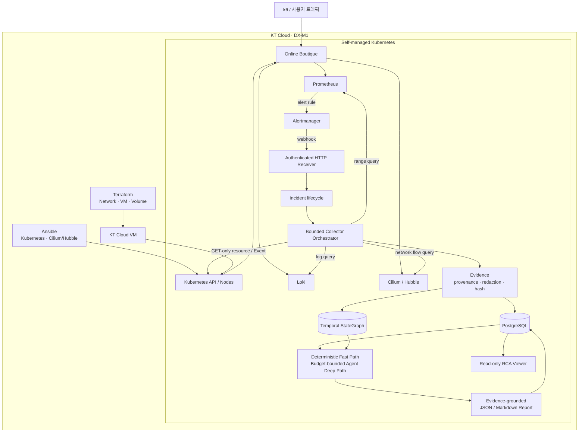

# Cloud-Native Operations & RCA Lab

KT Cloud의 VM 위에 재현 가능한 self-managed Kubernetes 운영환경을 만들고,
Prometheus·Loki·Alertmanager·Kubernetes API·Cilium/Hubble에서 수집한 Evidence로
Google Online Boutique 장애를 분석하는 인프라/SRE 포트폴리오다.

Temporal StateGraph와 budget-bounded Agent RCA는 플랫폼의 목적 자체가 아니라,
운영자가 조사할 범위를 줄이고 모든 결론을 실제 Evidence로 추적하기 위한
자동화 계층이다.

## 확정된 실행 경계

- cloud target: KT Cloud
- 우선 대상 zone: `DX-M1`
- Kubernetes: VM 기반 self-managed cluster
- cluster bootstrap/configuration: Ansible
- CNI 및 network evidence: Cilium + Hubble
- target application: Google Online Boutique `v0.10.6`
- RCA 권한: read-only, bounded query, 근거 부족 시 `ABSTAIN`

KT Cloud 계정에서 사용할 인증·Compute·Network·Block Storage API와 표준
OpenStack provider 호환성은 아직 확인되지 않았다. 따라서 provider 이름과
Terraform 리소스를 추측해서 구현하지 않고 capability gate 뒤에 둔다.

## 포트폴리오에서 보여줄 역량

1. capability가 확인된 KT Cloud API를 Terraform으로 재현한다.
2. Ansible로 Kubernetes control plane/worker, Cilium과 Hubble을 구성하고 검증한다.
3. metric, log, event, resource state와 network flow를 Incident time window로 묶는다.
4. 반복 가능한 fault fixture와 수동 troubleshooting 결과를 자동 RCA와 비교한다.
5. 최소 권한, redaction, timeout, partial failure, 비용과 destroy 경계를 검증한다.
6. 모든 RCA 결론을 `evidence_id`로 추적하고 근거가 부족하면 판단을 보류한다.

AI/LLM 기능보다 인프라 생성, 관측, 장애 재현, troubleshooting과 운영 검증
Evidence를 먼저 제시한다.

## 목표 아키텍처



Alertmanager는 장애 신호를 전달하고, RCA 플랫폼은 Incident 범위 안에서 각
provider를 read-only로 조회한다. 수집 결과는 provenance와 hash를 가진 Evidence로
정규화되며, 모든 원인 판단과 보고서는 실제 `evidence_id`를 통해 역추적할 수 있다.

## 데이터 수집 경계

- query에는 `online-boutique` namespace, workload와 Incident time window가 반드시
  포함된다.
- 원본 metric/log/network flow는 각 관측 시스템의 retention에 두고, Evidence와
  StateGraph에는 요약, provenance, content hash와 필요한 state만 저장한다.
- 검색 결과 없음, retention 만료, timeout과 provider 실패를 구분한다.
- eBPF/Hubble은 보조 evidence이며 모든 장애의 기본 원인을 대신 판정하지 않는다.

## 문서

- [KT Cloud 전환 로드맵](docs/roadmap/kt-cloud-plan.md)
- [KT Cloud 목표 아키텍처](docs/architecture/kt-cloud-overview.md)
- [KT Cloud capability matrix](docs/provider/kt-cloud-capability-matrix.md)
- [Phase 0 범위](docs/scope/project-scope.md)
- [현재 구현된 Core 아키텍처와 Flow](docs/architecture/implemented-core-flow.md)
- [Provider contract](contracts/providers.md)
- [AI-assisted 개발 원칙](docs/development/ai-assisted-workflow.md)

이전 GCP/GKE 실행물, 로컬 작업 계획과 개인 면접 메모는 공개 저장소에서
제외한다.

## Provider 확장 계획

현재 구현 범위는 bounded HTTP transport, Prometheus range-query와 Kubernetes
resource/Event read-only provider다. 아래 provider는 장애 원인 범위를 넓히기 위한
후속 후보이며, 현재 코드·배포 manifest·runtime 연동이 구현됐다는 뜻이 아니다.

- Loki application/container log
- OpenTelemetry trace
- Cilium/Hubble network flow
- Git·Argo CD·Kubernetes rollout 기반 deployment/change history
- database connection, lock, replication과 slow-query 상태
- queue/worker backlog, consumer와 retry 상태
- node OS, container runtime과 filesystem 상태
- DNS, Ingress, Load Balancer와 external dependency 상태
- cloud audit/event와 quota 상태

추가 provider는 실제 fault scenario가 필요성을 입증할 때 하나씩 구현한다. 모든
provider는 원인을 직접 선언하지 않고 관측 사실을 공통 `EvidenceItem`으로
정규화하며, read-only scope, time window, item/response limit, provenance,
redaction과 partial failure 계약을 따라야 한다.

## 범용 Temporal StateGraph 방향

StateGraph core는 Kubernetes, 특정 fintech 업무 또는 ChainOps ontology에
종속시키지 않는다. 현재 Online Boutique는 첫 reference workload일 뿐이며,
범용 core는 운영 장애를 설명하는 다음 네 record와 Evidence 연결만 책임진다.

전체 Evidence-to-Graph 흐름과 계층별 책임은 다음과 같다.

```text
Prometheus / Kubernetes API·Event / Loki / Hubble / 기타 관측 소스
    ↓ read-only 수집
Provider
    ↓ ProviderBatch(EvidenceDraft)
Collector / EvidenceBuilder
    ↓ contract-valid EvidenceItem
Domain Projector
    ↓ Entity / SnapshotInterval / RelationInterval / EventAggregate
GraphRepository
    ↓ persistent adapter
Graph DB                         현재 fixture는 in-memory repository
    ↓ InvestigationScope로 제한된 탐색
GraphLocalizer
    ↓ frozen Context Package
RCA Agent                       후속 구현
```

Provider는 `GraphRecord`를 직접 생성하지 않는다. Provider는 관측 결과를
`EvidenceDraft`로 반환하고, `EvidenceBuilder`가 provenance, hash, redaction과
schema 검증을 적용해 공통 `EvidenceItem`으로 정규화한다. 도메인별 Projector만
검증된 `EvidenceItem`을 읽어 Graph의 Entity, 상태, 관계와 Event 집계로 변환한다.
따라서 Provider는 Evidence 계약에, Projector는 Evidence와 Graph record 계약에,
GraphRepository는 Graph record 계약에 각각 의존한다.

```text
Entity            조사 가능한 서비스, 프로세스, 데이터 저장소, 인프라 리소스
SnapshotInterval  한 Entity의 정규화된 상태가 유효했던 시간 구간
RelationInterval  Entity 사이 관계가 유효했던 시간 구간
EventAggregate    반복된 상태 변화나 운영 Event의 시간 기반 집계
```

각 record는 안정적인 ID, `valid_from`/`valid_to`, 정규화된 state 또는 relation,
provenance와 `evidence_id`를 가져야 한다. 원본 metric, log, trace와 resource JSON
전체를 Graph에 복제하지 않고, 검증된 Evidence에서 파생된 상태와 관계만 저장한다.

도메인 차이는 core schema가 아니라 projector가 담당한다.

```text
Kubernetes projector  Deployment, Pod, Service, Node, Config, Volume
Web service projector API, Service, Job, Queue, Cache, Database, Dependency
Fintech projector     Request, Transaction, Ledger/Settlement state, Gateway
```

공통 관계는 `DEPENDS_ON`, `CALLS`, `ROUTES_TO`, `PROCESSES`, `READS_FROM`,
`WRITES_TO`, `RUNS_ON`, `CHANGED_BY`처럼 운영 의미 중심으로 제한한다. 특정 도메인
관계가 필요하면 별도 projector vocabulary로 확장하되 Agent에 전달하기 전 공통
Context Package로 변환한다.

현재 domain-neutral Graph record와 `InvestigationScope`, 연속 동일 상태/관계를
병합하는 in-memory interval repository, Kubernetes Evidence projector와 bounded
localizer까지 fixture로 구현했다. Persistent Graph backend, Kubernetes watch 기반
연속 projection과 Agent runtime 연결은 아직 구현하지 않았다. 특정 ChainOps
모델은 현재 활성 범위에 포함하지 않는다.

## 저장소 구조

```text
automation/ansible/  self-managed cluster 자동화 경계와 공통 dependency
config/              프로젝트 범위, KT capability, RCA routing 정책
contracts/           Incident, Evidence, Graph, RCA 및 provider 계약
db/migrations/       PostgreSQL schema migration
docs/                아키텍처, ADR, runbook, 진행 기록
evaluation/          평가 사전등록과 Ground Truth 격리 정책
infra/terraform/     KT Cloud capability 확인 후 구현할 provisioning 경계
platform/            cloud-neutral Kubernetes manifest와 Kustomize base
src/                 Incident/Evidence/RCA core
tests/               deterministic fixture와 core unit test
tools/               정적 검증 도구
```

## 현재 가능한 검증

초기 1회 로컬 검증 환경을 만든다.

```bash
make bootstrap-dev
```

`requirements.txt`는 Core가 직접 import하는 런타임 라이브러리,
`requirements-dev.txt`는 위 의존성과 YAML 기반 로컬 검증 도구를 설치한다.
개발 환경은 `platform/versions.yaml`과 동일하게 Python 3.12를 사용한다.

그다음 Core 검증을 실행한다.

```bash
make validate-core
```

이 검증은 contract, 인증·request limit이 적용된 Alertmanager HTTP 경계,
입력 정규화, Incident lifecycle, Collector의 병렬 실행·timeout·retry·partial
failure, Evidence redaction/hash, deterministic RCA와 Fast Path report를
fixture로 확인한다.

`POSTGRES_TEST_DSN`이 없는 기본 검증에서는 실제 DB 테스트 한 건을 건너뛴다.
승인된 테스트 전용 PostgreSQL DSN을 환경 변수로 제공하면 random schema를
만들어 동일 repository contract를 실행하고 그 schema만 제거한다. 공유 DB를
truncate하지 않으며 DSN을 저장소나 명령 출력에 기록하지 않는다.

KT Cloud capability gate 상태는 다음 파일에서 확인한다.

```bash
make ktcloud-readiness
```

필수 API가 확인되기 전에는 이 명령이 의도적으로 준비 미완료 상태를 반환한다.

Online Boutique remote base render에는 GitHub 접근이 필요하다.

```bash
kubectl kustomize platform/online-boutique
```
